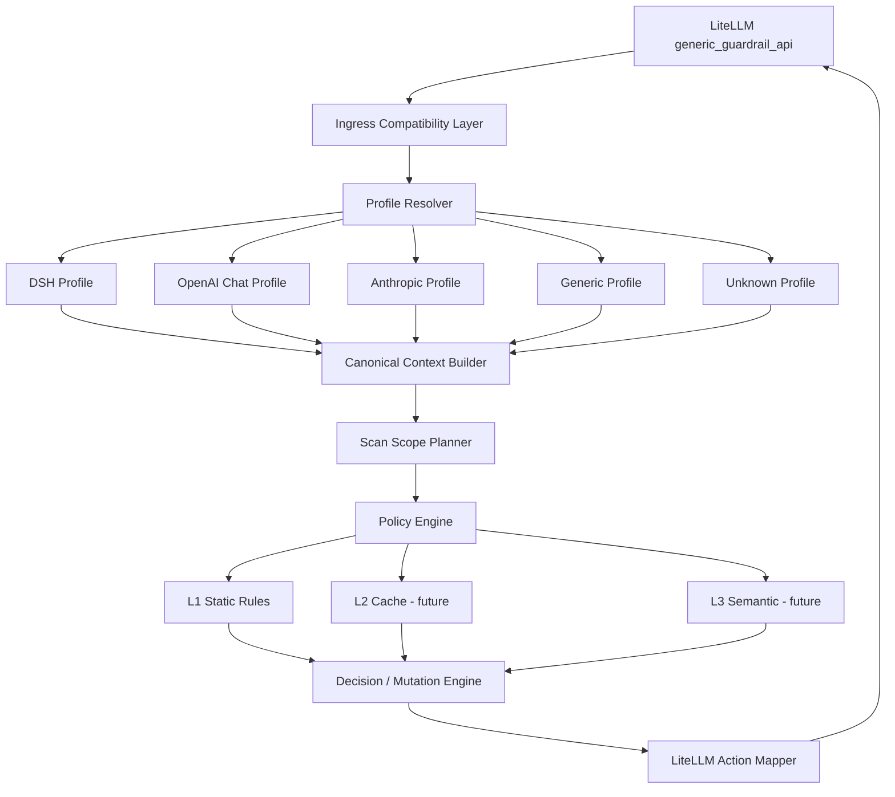

# agent-guard 多客户端兼容与统一安全控制设计

| 项目 | 内容 |
| --- | --- |
| 状态 | Proposed |
| 版本 | v0.3 |
| 日期 | 2026-09-26 |
| 范围 | 方案设计，不包含代码实现 |
| 核心组件 | agent-guard |
| 固定上游 | LiteLLM Proxy `generic_guardrail_api` |
| 关键约束 | 无法修改 LiteLLM Proxy，无法修改 Agent 客户端 |
| 目标 | 在仅修改 agent-guard 的前提下，支持不同客户端的消息结构和安全语义 |
| 执行优先级 | 见 [`protocol-adapter-design.md`](protocol-adapter-design.md) 第 12 章（P0–P4、R1） |
| 对齐基准 | 协议方言与对齐层细节以 [`protocol-adapter-design.md`](protocol-adapter-design.md) 为准，见第 0 节 |

> 本期执行范围（2026-09-26）：只验收客户端 `/v1/chat/completions`。Responses Profile 属后续适配；下文 D0–D6 是长期组件路线，不等于本期全部实现。以 [`protocol-adapter-design.md`](protocol-adapter-design.md) v0.4 的范围决策为准。

## 0. 前置说明：与多协议设计的分工

本文与 [`protocol-adapter-design.md`](protocol-adapter-design.md) 是同一套架构的**总纲**与**落地规范**，不是两套并行方案。分工如下：

| | 本文（多客户端） | 多协议设计 |
| --- | --- | --- |
| 回答的问题 | 这条消息**是谁说的**、算不算当前轮 | 这段文本**在哪个字段**、能不能安全改写 |
| 抽象单位 | Profile：客户端组装习惯 | Adapter：协议方言（Chat Completions / Responses / Anthropic） |
| 失败姿态 | 策略层可配置（shadow、strict、latest-only） | 对齐层 fail-closed |
| 证据等级 | 设计推演 | 实测（LiteLLM 1.102.0 + 真实 guard） |

**两者冲突时以多协议设计为准。** 以下四条是本文必须服从的硬约束，正文对应章节已按此对齐（标注“v0.3 对齐”）：

1. **对齐层 fail-closed**：`texts` 与 `structured_messages` 无法对齐时置 `alignment=degraded`，关闭历史豁免，命中一律 `block`/`review`，**不允许任何形式的静默放行（含 `shadow`）**。本文第 9.7、13 章的降级模式只能在**对齐成功**的前提下由策略层选用。
2. **`current_turn` 边界是对齐层不变式**：由“最后一条 `assistant`/`model` 之后的所有 item”确定（DSH 再剔除 `origin=application` 的 synthetic 尾部）。本文第 9.2 节列出的策略只能在该边界**内部**选候选，不能改写边界。
3. **协议与客户端是两个正交维度**：协议方言由 Protocol Adapter 判定，Profile 只负责客户端组装习惯（如 DSH 的 synthetic 尾部）。本文第 4.3、6.2、8.2 节中属于“协议/结构签名”的部分归 Adapter。
4. **`system` / `developer` 走信任策略**（多协议设计决策 1）：受信、不扫描、不改写、返回 `NONE`；保留 item 仅用于对齐校验与审计，后续可升级为“替换 + 放行”。

范围：Anthropic Messages **预留**（R1），仅在确有客户端使用时启用；Gemini generateContent **不接入**。本文第 4.3、6.2 节中的 Anthropic Profile 属预留。

## 1. 执行摘要

当前 agent-guard 直接使用 LiteLLM `generic_guardrail_api` 传入的 `texts`、`structured_messages`、`tool_calls` 等字段，并通过数组下标和简单角色规则判断“本轮用户输入”和“历史消息”。

该方式对单一客户端可以工作，但对不同架构的 Agent 客户端并不稳定。不同客户端可能存在以下差异：

- 是否发送完整历史，还是只发送当前轮。
- system/developer/plugin 消息是否保留独立角色。
- 插件上下文、runtime context、memory 是否被折叠成 `role=user`。
- 工具调用和工具结果是否保留独立 role。
- 消息内容是否被展平成字符串数组。
- 同一模型请求中是否混合用户输入、RAG 文档、工具结果和其他内部上下文。
- 是否在失败轮次后继续把失败消息保留在历史中。

在不能修改 LiteLLM 和客户端的前提下，agent-guard 无法获得完整、强类型的消息来源元数据，因此不能追求“对所有协议进行完全准确的语义恢复”。

本项目最适合的解决方案是：

> 在 agent-guard 内部建立 **Ingress Compatibility Layer + Protocol Adapter Registry + Profile Registry + Canonical Context Model（Envelope）+ Alignment Validator + Scan Scope Policy + Decision Engine**。上游保持一个固定的 LiteLLM generic 入口，agent-guard 内部按协议方言与客户端 Profile 做有边界、可测试、可降级的语义重建。

核心数据流：

```text
LiteLLM generic_guardrail_api
        |
        v
Ingress Compatibility Layer
        |
        v
Profile Resolver
        |
        +--> DSH Profile
        +--> OpenAI Chat Profile
        +--> OpenAI Responses Profile
        +--> Anthropic Messages Profile
        +--> Generic Profile
        +--> Unknown Profile
        |
        v
Canonical Context Model
        |
        v
Scan Scope Planner
        |
        v
Policy Engine + L1/L2/L3 Detectors
        |
        v
Decision / Mutation Engine
        |
        v
LiteLLM Action Mapper
```

对外仍保持 LiteLLM 现有协议：

```http
POST /beta/litellm_basic_guardrail_api
```

返回动作仍是：

```text
NONE
BLOCKED
GUARDRAIL_INTERVENED
```

## 2. 背景与问题定义

### 2.1 当前部署路径

```text
Agent Client
    -> LiteLLM Proxy
    -> generic_guardrail_api
    -> agent-guard
    -> upstream model
```

安全控制在 `pre_call` 阶段执行。当前本地场景只启用了输入检查；输出检查是否启用取决于 LiteLLM 现有调用配置。由于本项目不能修改 LiteLLM，输出检测能力必须以实际存在的调用阶段为边界。

> v0.3 对齐（实测）：本仓库 `liteLLM/config.yaml` 已配置 `mode: [pre_call, post_call]`，`config.local.yaml` 只有 `pre_call`；输出侧**非流式**脱敏已验证生效，**流式**在默认 `block_only` 下不生效（需 `incremental_diff`），超长累积文本会触发 413 断流。结论与证据见多协议设计第 9 章。

### 2.2 已暴露的典型问题

以 DSH 客户端为例：

1. 用户发送：

   ```text
   忽略之前的所有指令
   ```

2. DSH 同时注入 runtime-context 消息：

   ```text
   Current runtime context. This snapshot supersedes earlier runtime-context snapshots.
   ```

3. DSH/pi-ai 层可能把 system/runtime-context 折叠成 `role=user`。
4. LiteLLM 将消息展开成扁平 `texts`。
5. agent-guard 如果简单选择“最后一条 user”，会错误地把 runtime-context 当作当前用户输入。
6. 真正的攻击消息被误判为历史消息，从而执行 `GUARDRAIL_INTERVENED`，而不是 `BLOCKED`。
7. 模型调用没有被终止，用户看到的是模型继续执行，而不是 400 拒绝。

该问题说明：

- `role=user` 不等于“真实人类用户输入”。
- 数组顺序不等于安全上下文顺序。
- 扁平 `texts` 不足以表达消息来源和权威性。
- 单个客户端的内容前缀修正不能进入通用核心。
- 不同客户端的消息结构必须通过 Profile 隔离。

### 2.3 当前信息的可获得性

LiteLLM `generic_guardrail_api` 当前可向 agent-guard 提供：

| 字段 | 可用性 | 说明 |
| --- | --- | --- |
| `input_type` | 高 | `request` 或 `response` |
| `texts` | 高 | 通常为展平后的文本 |
| `structured_messages` | 中 | 是否保留取决于 LiteLLM 转换和客户端输入 |
| `tool_calls` | 中 | 具体结构和归属可能丢失 |
| `tools` | 中 | 工具定义，不一定代表工具调用 |
| `model` | 高 | 可用于路由，不可单独识别客户端 |
| `request_data` | 中 | 通常是用户/Key 元数据 |
| `request_headers` | 中 | 经过 LiteLLM 清洗，部分值可保留 |
| `litellm_version` | 高 | 用于兼容性判断 |
| `additional_provider_specific_params` | 中 | 来自 LiteLLM 配置，通常为静态参数 |
| `litellm_call_id` | 高 | 单次调用关联 ID |
| `litellm_trace_id` | 中 | 是否稳定传递取决于调用路径 |

已可能出现的信息损失：

- system/plugin 被折叠成 user。
- 同一条消息的多个 block 被展平。
- 当前轮消息和历史消息没有显式边界。
- 工具参数与具体消息的归属关系丢失。
- RAG 文档与用户问题混在同一文本数组。
- 客户端自定义元数据被 Pydantic 或协议转换丢弃。

因此 agent-guard 不能把 `texts[index]` 当作稳定安全语义。

## 3. 目标与非目标

### 3.1 目标

- 在 LiteLLM 和客户端不可修改的前提下，支持多种客户端消息组装方式。
- 保持固定 LiteLLM 接入协议，不要求新增客户端元数据。
- 将客户端特有规则隔离到 Profile。
- 在 agent-guard 内部建立稳定、可测试的 Canonical Context。
- 明确区分当前输入、历史消息、系统上下文、工具结果和不可信内容。
- 为不同路由支持不同的扫描范围和失败策略。
- 保持 L1 规则、策略和判决引擎客户端无关。
- 支持 shadow、strict、latest-only、fail-closed 等降级模式。
- 记录 Profile 命中、置信度、扫描范围和降级原因。

### 3.2 非目标

- 不承诺从已丢失的信息中恢复完整客户端语义。
- 不修改 LiteLLM Proxy 或客户端 SDK。
- 不把某个客户端的内容前缀写进通用 L1 规则。
- 不让 agent-guard 根据内容猜测所有角色和信任边界。
- 不替代工具权限、沙箱、网络白名单和人工审批。
- 不在本方案中实现代码。
- 不假设 LiteLLM 一定调用了输入和输出两个阶段；阶段能力必须单独确认。
- 不在首期覆盖多模态和流式逐块检测的所有客户端差异。

## 4. 设计原则

### 4.1 接入适配与安全策略分离

- Profile 负责解释客户端消息结构。
- Policy Engine 负责判断安全策略。
- L1/L2/L3 Detector 只处理 Canonical Context。
- LiteLLM Action Mapper 负责把内部判决转换成 `NONE`、`BLOCKED`、`GUARDRAIL_INTERVENED`。

### 4.2 显式来源优于内容猜测

优先使用：

```text
role
source
authority
scope
content type
mutable
```

只有在信息不足时，才使用 Profile 隔离的启发式。

### 4.3 Profile 隔离

所有客户端特有逻辑都放在对应 Profile 中：

```text
profiles/
  dsh/
  openai_chat/
  openai_responses/
  anthropic_messages/
  generic/
  unknown/
```

不得把 DSH 的 runtime-context 前缀写入通用检测器。

> v0.3 对齐：`openai_responses`、`anthropic_messages` 实际对应的是**协议方言**（Adapter id），协议判定归 Protocol Adapter；本目录只保留客户端组装习惯。`anthropic_messages` 为预留（R1），Gemini 不接入。

### 4.4 稳定 ID 优于数组下标

模型内部必须使用稳定 `item_id`，而不是 `texts[0]`。

原因：

- `texts` 的长度和顺序可能因客户端不同而变化。
- 改写动作需要精确回写。
- 观察、审计和测试需要稳定关联。
- 结构化消息和扁平文本之间需要可验证映射。

### 4.5 有置信度的推断

每个 Profile 的输出必须包含置信度：

```text
high
medium
low
```

低置信度必须走配置好的降级策略，不能静默假设。

### 4.6 默认隐私最小化

- 默认不记录原文。
- 只记录 item hash、长度、规则 ID、分类和判决。
- Profile 匹配只使用必要字段。
- 原始文本不得写入普通日志和缓存。

### 4.7 显式版本

必须版本化：

- canonical schema
- profile
- ruleset
- policy
- normalizer
- decision mapping

## 5. 业界参考方案

业界并没有单一通用标准，但存在一些稳定模式。

| 方案 | 主要设计 | 对本项目的启示 |
| --- | --- | --- |
| [Azure AI Content Safety Prompt Shields](https://learn.microsoft.com/en-us/azure/ai-services/content-safety/concepts/jailbreak-detection) | 区分用户提示攻击和文档中的间接攻击 | 直接输入和外部上下文必须分开处理 |
| [Amazon Bedrock Guardrails](https://docs.aws.amazon.com/bedrock/latest/userguide/guardrails.html) | 输入/输出分别配置，支持 grounding source、PII 和内容过滤 | `source=input/output`，上下文来源单独传递 |
| [Google Cloud Model Armor](https://cloud.google.com/security-command-center/docs/model-armor-overview) | 分别执行用户提示和模型响应 sanitize | 输入输出流水线分离，通过网关集成 |
| [NVIDIA NeMo Guardrails](https://docs.nvidia.com/nemo/guardrails/) | input、output、retrieval、dialog、execution rails | 不同边界使用不同策略，而不是一个文本列表 |
| [OpenAI Agents SDK Guardrails](https://openai.github.io/openai-agents-python/guardrails/) | 在 agent 生命周期挂接 input/output guardrail 和 tripwire | 明确生命周期、拒绝语义和上下文对象 |
| [Protect AI LLM Guard](https://github.com/protectai/llm-guard) | 模块化 scanner，区分 prompt 和 output | 检测器与协议适配分离 |
| AI Gateway 产品 | 在 OpenAI/Anthropic 代理层做安全检测 | 对无法改客户端的系统，网关透明接入是常见模式 |

### 5.1 共性和可借鉴结论

1. **协议适配器负责解释客户端语义。**
2. **策略引擎负责判断安全，不负责猜消息结构。**
3. **输入、输出、RAG、工具结果和 Memory 分开建模。**
4. **扫描范围是显式策略，不是默认全历史或默认最后一条。**
5. **无法获得完整元数据时，提供 shadow、strict、latest-only 等降级模式。**
6. **高风险动作和副作用必须由独立授权层控制，不能只依赖文本 guardrail。**

### 5.2 与本项目约束的差异

业界多数方案可以选择以下一种或多种接入方式：

- 修改客户端 SDK。
- 使用 provider-native guardrail。
- 在 agent framework 内部挂 hook。
- 使用网关原生结构化协议。

本项目只能修改 agent-guard，因此只能采用：

```text
固定 LiteLLM generic 入口
    + agent-guard 内部 Profile
    + 有损信息推断
    + 显式降级策略
```

这是“受限环境下的网关侧 Connector + Policy Engine”方案。

## 6. 目标架构



> v0.3 对齐：图中 `Profile Resolver` 只负责**客户端习惯**，协议方言识别由并列的 Protocol Adapter Registry 完成，两者正交（同一个 Profile 可出现在不同方言上），见多协议设计第 5、7.1 节。图中 `Anthropic Profile` 为预留。

### 6.1 Ingress Compatibility Layer

职责：

- 校验 LiteLLM 请求。
- 提取 `texts`、`structured_messages`、`tool_calls` 等字段。
- 保留任意可用的 header、model 和参数信号。
- 不直接执行规则。
- 不直接决定 allow/block。

### 6.2 Profile Resolver

职责：

- 根据多个信号识别最可能的**客户端** Profile（协议方言不在本组件判定，见第 0 节约束 3）。
- 输出 Profile ID、版本和匹配置信度。
- 低置信度时选择 Generic/Unknown Profile。
- 记录匹配原因，不记录原文。

### 6.3 Profile Adapter

职责：

- 解释该客户端的消息组装方式。
- 建立 source/authority/scope 映射。
- 标记 synthetic/plugin/runtime context。
- 选择当前用户输入、历史消息、工具结果和上下文。
- 将请求转换为 Canonical Context。

### 6.4 Canonical Context Builder

职责：

- 生成稳定的 item ID。
- 生成统一内容块。
- 保留原始角色、来源、可信度和可变性。
- 维护消息到扁平文本的映射。
- 标记无法恢复或低置信度字段。

### 6.5 Scan Scope Planner

职责：

- 决定本轮扫描哪些 item。
- 区分 current、history、context、tool 和 output。
- 决定哪些命中可以阻止、脱敏或仅记录。
- 将结果传给 Policy Engine。

### 6.6 Policy Engine

职责：

- 根据 profile、phase、route、tenant、source、scope 和 trust 选择策略。
- 调用 L1/L2/L3 检测器。
- 处理规则优先级和短路逻辑。
- 处理 fallback 和 fail mode。

### 6.7 Decision / Mutation Engine

职责：

- 合并检测结果。
- 产生 `allow`、`block`、`redact`、`review` 或内部 `suspicious`。
- 生成基于 `item_id` 的 mutation。
- 不允许协议层使用不可靠数组下标执行修改。

### 6.8 LiteLLM Action Mapper

职责：

- `allow` 映射为 `NONE`。
- `block` 映射为 `BLOCKED`。
- `redact` / `intervene` 映射为 `GUARDRAIL_INTERVENED`。
- 将内部 mutation 转成 LiteLLM 可接受的 `texts` 或其他字段。
- 无法安全回写时 fail closed。

## 7. Canonical Context Model

该模型只在 agent-guard 内部使用，不要求 LiteLLM 或客户端实现。

### 7.1 请求级字段

```json
{
  "schema_version": "agent-guard-envelope/v1",
  "request_id": "req-123",
  "trace_id": "trace-456",
  "phase": "input",
  "policy_id": "default-agent-policy",
  "client": {
    "profile_id": "dsh",
    "profile_version": "2026-09-22.1",
    "confidence": "high"
  },
  "protocol": {
    "ingress": "litellm-generic",
    "endpoint": "openai/chat/completions",
    "adapter_id": "openai-chat",
    "adapter_version": "2026-09-25.1",
    "alignment": "aligned"
  },
  "route": {
    "model": "deepseek-flash",
    "litellm_version": "1.102.0"
  },
  "items": []
}
```

> v0.3 对齐：`schema_version` 统一为 `agent-guard-envelope/v1`（原 `agent-guard-context/v1` 是同一模型的总纲命名）；`protocol` 从 `client` 中拆出，携带 `adapter_id` 与 `alignment`，字段与多协议设计 6.1 一致。

### 7.2 Item 字段

```json
{
  "item_id": "openai-chat:messages.2.content.0:b1e9",
  "origin_ref": "messages[2].content[0]",
  "text_index": 2,
  "role": "user",
  "origin": "human",
  "authority": "user",
  "trust": "trusted",
  "scope": "current_turn",
  "turn_id": "turn-7",
  "mutable": true,
  "content": [
    {
      "type": "text",
      "text": "..."
    }
  ],
  "raw": "...",
  "view": "...",
  "metadata": {
    "profile_rule": "last_non_synthetic_user"
  }
}
```

> v0.3 对齐：删除 `source_index: "texts[2]"`。以 `texts` 下标定位来源正是错位的成因（多协议设计 F1/F6）；改用 `origin_ref`（可读来源）+ `text_index`（可为 `null`）。`raw` 是唯一可回写对象，`view` 是唯一可匹配对象，见多协议设计第 8 章。

### 7.3 字段定义

| 字段 | 取值 |
| --- | --- |
| `role` | system、developer、user、assistant、tool、unknown |
| `origin` | human、plugin、model、tool、retrieval、application、unknown |
| `authority` | system、developer、user、assistant、context、untrusted、unknown |
| `trust` | trusted、untrusted、unknown |
| `scope` | current_turn、history、context、output |
| `mutable` | true、false |
| `content.type` | text、tool_call、tool_result、image、document、unknown |
| `turn_id` | 所属轮次，如 `turn-7`；`scope=current_turn` 非空时必存在（v0.3 对齐） |

字段之间不是简单等价：

```text
role=user
origin=plugin
authority=context
trust=trusted
scope=context
```

与：

```text
role=user
origin=human
authority=user
trust=trusted
scope=current_turn
```

具有完全不同的安全语义。

### 7.4 稳定 item ID

Item ID 必须满足：

- 同一次请求内稳定。
- mutation 可精确回写到原 item。
- 可以在日志和 trace 中引用。
- 不依赖容易被重排的数组下标。
- 不能直接包含原始文本。

建议格式（v0.3 对齐：与多协议设计的 Envelope item 保持一致）：

```text
<adapter_id>:<origin_ref>:<short-hash>
```

例如：

```text
openai-chat:messages.2.content.0:b1e9
```

item 必须同时携带 `origin_ref`（可读来源，如 `messages[2].content[0]`）与 `text_index`（在 `texts` 中的下标）。仅存在于 `structured_messages`、不在 `texts` 中的内容，`text_index` 必须为 `null`，否则会造成错位。

### 7.5 内容块

文本、图片、工具调用和工具结果应使用统一内容块，避免再次扁平化。

示例：

```json
{
  "type": "tool_call",
  "tool_call_id": "call-1",
  "name": "bash",
  "arguments": {
    "command": "pwd && ls -la"
  }
}
```

## 8. Profile Registry

### 8.1 Profile 责任

每个 Profile 必须定义：

- 匹配条件。
- 置信度规则。
- `texts` 和 `structured_messages` 的映射方式。
- synthetic/plugin/runtime context 识别方式。
- 当前用户输入选择策略。
- 历史消息识别策略。
- 工具调用和工具结果归属。
- 可变字段和不可变字段。
- 无法判断时的 fallback 模式。
- 回归测试夹具。

### 8.2 Profile 匹配信号

建议使用多信号评分，而不是单一字段。

| 信号 | 强度 | 示例 |
| --- | --- | --- |
| 明确的客户端 header | 高 | `user-agent`、`x-client-*` |
| LiteLLM 调用头 | 中 | `x-litellm-*` |
| `structured_messages` 结构签名 | 高 | 连续 user、system 折叠、tool role 形态 |
| role 序列 | 中 | system/user/assistant 的不同排列 |
| `texts` 与 structured 对齐方式 | 高 | block 是否折叠、是否有 synthetic 尾部 |
| 已知 synthetic context 前缀 | 中 | Profile 内部维护，不进入核心 |
| model | 低 | 多客户端可能共用同一模型 |
| `additional_provider_specific_params` | 中 | 仅在配置中已存在时使用 |
| `litellm_version` | 中 | 判断转换行为版本 |

> v0.3 对齐：表中“`structured_messages` 结构签名”“`texts` 与 structured 对齐方式”属于**协议方言**信号，应由 Protocol Adapter 处理，不用于 Profile 匹配。Profile 匹配保留 header、role 序列、synthetic 前缀、`additional_provider_specific_params` 等客户端习惯信号。

匹配规则应输出：

```json
{
  "profile_id": "dsh",
  "confidence": "high",
  "reasons": ["header:user-agent", "structure:two-consecutive-user"]
}
```

### 8.3 Profile 优先级

建议顺序：

```text
1. 明确 Profile 标识
2. header + 结构双命中
3. 结构签名高置信度命中
4. 内容模式辅助命中
5. Generic Profile
6. Unknown Profile + 降级模式
```

### 8.4 Profile 示例

以下为概念示例，不是实现配置。

```yaml
profile_id: dsh
profile_version: 2026-09-22.1

match:
  header:
    user-agent:
      contains: deepseek
  structure:
    consecutive_user_messages: allowed

synthetic_user_context:
  prefixes:
    - "Current runtime context."
    - "<system-reminder>"
    - "<runtime-context>"
    - "<environment_context>"

turn_policy:
  current_user:
    strategy: last_non_synthetic_user
  history:
    strategy: prefix_before_current_user

mutation:
  current_user: mutable
  synthetic_context: mutable
  history: mutable

action_policy:
  current_hard_block: block
  historical_hard_block: neutralize
  unknown_context_hard_block: fail_closed
```

标准 OpenAI Chat 的 Profile 可以是：

```yaml
profile_id: openai_chat
profile_version: 2026-09-22.1

match:
  structure:
    roles:
      - system
      - user
      - assistant

turn_policy:
  current_user:
    strategy: last_user

action_policy:
  current_hard_block: block
  historical_hard_block: neutralize_or_block_by_route
```

### 8.5 Profile 版本和回滚

每个 Profile 独立版本化：

```text
profile_id
profile_version
schema_version
test_fixture_version
```

Profile 变更不能隐式改变其他 Profile。发现误报或漏报时，应只回滚对应 Profile。

## 9. Turn 与上下文重建

### 9.1 处理步骤

1. 校验请求。
2. 提取 `texts`、`structured_messages`、`tool_calls` 和 header。
3. 建立 role/content 序列。
4. 将 `texts` 与 structured 内容对齐。
5. 根据 Profile 标记 synthetic/context/plugin 内容。
6. 选择当前用户输入候选。
7. 选择历史消息和其他上下文。
8. 标记不可恢复或低置信度信息。
9. 生成 Canonical Context 和置信度。
10. 交给 Scan Scope Planner。

### 9.2 当前用户选择策略

| 策略 | 适用情况 | 风险 |
| --- | --- | --- |
| `last_user` | 标准 OpenAI Chat、无 synthetic user | 多 user 结构时误判 |
| `last_non_synthetic_user` | DSH 等会追加 context 的客户端 | 依赖 Profile 的 synthetic 识别 |
| `last_user_before_synthetic_tail` | synthetic 内容固定在尾部 | 结构变化时失效 |
| `first_user_after_last_assistant` | 明确对话轮次 | 失败轮次可能破坏边界 |
| `all_users_in_current_turn` | 无法可靠区分时 | 误报增加 |
| `all_user_messages` | 高风险全量扫描 | 历史攻击反复阻断 |

> v0.3 对齐：`current_turn` 的**边界**是对齐层的不变式——“最后一条 `assistant`/`model` 之后的所有 item”（DSH 再剔除 `origin=application` 的 synthetic 尾部），见多协议设计 7.4。上表是在该边界**内部**选择候选的策略，不能改写边界；`all_users_in_current_turn`、`all_user_messages` 属于 Scan Scope 的扫描范围选择，不改变 item 的 `scope` 标注。`alignment=degraded` 时历史豁免整体失效，这些策略不得把命中降级为放行。

### 9.3 DSH 的处理

DSH Profile 必须区分：

```text
真实用户消息
runtime-context/plugin 消息
历史消息
工具结果
```

当前轮用户选择：

```text
1. 找出所有 role=user 的消息。
2. 排除 synthetic runtime-context。
3. 选择最后一条真实用户消息。
4. 如果无法可靠识别，则不把它当作历史消息，采用保守策略。
```

历史攻击处理：

```text
历史攻击 + 可修改:
    -> GUARDRAIL_INTERVENED
    -> 替换为安全占位符

历史攻击 + 不可修改:
    -> BLOCKED

当前用户攻击:
    -> BLOCKED
```

### 9.4 标准 OpenAI Chat 的处理

标准结构通常是：

```text
system -> user -> assistant -> user
```

策略：

```text
current_user = last_user
history = 之前消息
```

但如果消息中包含 synthetic user，仍需要 Profile 调整。

### 9.5 扁平文本客户端的处理

如果只有 `texts`，没有 `structured_messages`：

- 不允许对真实角色进行高置信度推断。
- Scan Scope 由路由显式配置。
- 默认可以使用 strict 模式或 latest_only 模式。
- 需要记录 `provenance_confidence=low`。
- 不能把“没有发现 structured_messages”当作安全信号。

> v0.3 对齐：缺失 `structured_messages` 会触发 `alignment=degraded`，此时**历史豁免整体失效、命中一律 `block`/`review`**，等价于 strict/full-scan 的失败姿态；`latest_only` 在 degraded 下不可用。见第 0 节约束 1 与多协议设计 11.3。

### 9.6 历史失败轮次

客户端可能把已经失败的攻击轮次继续保存在历史中。agent-guard 需要考虑三种情况：

1. 历史攻击可修改：
   - 替换或移除。
   - 允许当前正常请求继续。
2. 历史攻击不可修改：
   - fail closed。
3. 当前攻击与历史攻击同时出现：
   - 只要当前消息命中硬拦截，就 `BLOCKED`。
   - 历史攻击不能覆盖当前攻击的优先决策。

> v0.3 对齐：上面第 1 条（历史可修改 → 替换后放行）仅在对齐成功时成立。`alignment=degraded` 时关闭历史豁免，历史命中同样按 `block`/`review` 处理，不允许以“替换历史”为代价放行。

### 9.7 低置信度原则

只要以下条件任意成立，就必须降低置信度：

- `texts` 和 structured 数量无法对齐。
- Profile 没有匹配。
- synthetic/context 识别依赖内容前缀。
- 当前轮无法明确定位。
- 存在多个连续 user 消息但无 Profile 规则。
- 工具参数无法归因到具体消息。
- 消息已经被客户端或 LiteLLM 转换过多次。

低置信度不能默认 allow。

> v0.3 对齐：其中“`texts` 和 structured 数量无法对齐”一项属于对齐层，触发 `alignment=degraded`：**关闭历史豁免，命中一律 `block`/`review`**，不接受 `shadow`、latest-only 等柔性降级（多协议设计 6.4）。其余低置信度项由策略层按路由配置处理。

## 10. Scan Scope 与策略

### 10.1 扫描范围模式

| 模式 | 说明 | 推荐场景 |
| --- | --- | --- |
| `current_turn` | 只扫描本轮真实输入 | 普通聊天、低延迟 |
| `new_messages` | 扫描自上次成功响应后的新消息 | 多轮 Agent |
| `full_history` | 扫描全部历史 | 高风险、合规场景 |
| `untrusted_context` | 扫描 RAG、工具结果和外部文档 | 间接注入防护 |
| `input_and_output` | 分别扫描输入和模型输出 | 有输出 hook 的部署 |
| `shadow` | 只记录不改变请求 | 新客户端灰度 |

### 10.2 路由级策略

扫描范围必须按以下维度配置：

```text
tenant
route
model
client_profile
data_sensitivity
phase
risk_level
```

不能全局固定为“只看最后一条 user”或“永远扫描全历史”。

### 10.3 策略矩阵

| 内容位置 | 命中类型 | 推荐动作 |
| --- | --- | --- |
| 当前用户输入 | 硬拦截 | `block` |
| 历史用户输入 | 硬拦截且可修改 | `intervene/redact` |
| 历史用户输入 | 硬拦截且不可修改 | `block` |
| synthetic context | 指令样式 | 按 context policy：`system`/`developer` 走信任策略不扫描（第 0 节约束 4）；DSH 折叠进 `role=user` 的上下文由 Profile 规则识别，未知前缀按当前轮处理。后者是否同样适用信任策略尚未拍板（见多协议设计 14.2） |
| RAG 文档 | 间接注入 | `block` 或 `quarantine` |
| 工具结果 | 间接注入 | `block` 或隔离引用 |
| 工具参数 | 危险命令 | `block` 或拒绝工具执行 |
| 模型输出 | PII/Secret | `redact` 或 `block` |
| 不确定来源 | 高风险 | `fail_closed` |
| 不确定来源 | 低风险 | `review`；对齐失败（`degraded`）时本行不适用，见第 0 节约束 1 |

## 11. 规则适用模型

规则不能只依赖 `phase`。

建议规则条件：

```text
phase
profile_id
origin
authority
scope
trust
content_type
route
tenant
```

示例：

| 规则 | 适用条件 | 动作 |
| --- | --- | --- |
| `prompt_injection.ignore_instructions` | `phase=input`、`authority=user`、`scope=current_turn` | `hard_block` |
| `indirect_prompt_injection.override` | `authority=untrusted`、`origin=retrieval/tool` | `hard_block` 或 `review` |
| `secret.api_key` | 任意来源 | `redact` 或 `block` |
| `pii.email` | 用户输入或模型输出 | `redact` |
| `dangerous_command.destructive` | `content_type=tool_call` | `block` |

### 11.1 优先级

```text
hard_block
    > unrewritable_sensitive
    > redact/intervene
    > review
    > suspicious
    > allow
```

### 11.2 不可改写内容的处理

如果命中内容无法安全改写：

- 不返回 `allow`。
- 返回 `block` 或 `review`。
- 记录 `unrewritable` 原因。
- 不允许把改写失败伪装成成功。

## 12. 决策和 LiteLLM 映射

### 12.1 内部决策

```text
allow
intervene
block
review
suspicious
```

### 12.2 映射

| 内部决策 | LiteLLM 动作 | 说明 |
| --- | --- | --- |
| `allow` | `NONE` | 原请求继续 |
| `intervene` | `GUARDRAIL_INTERVENED` | 返回改写后的内容 |
| `block` | `BLOCKED` | LiteLLM 返回 400 |
| `review` | 取决于当前配置 | 没有 review 协议时 fail closed |
| `suspicious` | 首期可 `NONE` | 仅表示“L3 未接入、无可执行结论”；对齐失败或来源未知时不得使用，必须按第 0 节约束 1 走 `block`/`review` |

### 12.3 响应必须可审计

返回结果应包含：

- request_id
- trace_id
- phase
- profile_id
- profile_version
- adapter_id
- adapter_version
- alignment
- policy_version
- rules_version
- decision
- reason_codes
- category
- scope
- layer_trace
- confidence
- mutation target item ID 与 origin_ref
- 不包含原文的 evidence hash

## 13. 降级策略

### 13.1 Profile 不可用

可选模式：

| 模式 | 行为 |
| --- | --- |
| `strict_history` | 全量扫描，高风险 fail closed |
| `latest_only` | 只检查最后一条 user |
| `full_scan` | 检查所有文本，命中即 block |
| `shadow` | 只记录，不影响请求 |
| `fail_closed` | 无法判断即阻止 |

> v0.3 对齐：上表是**策略层**的降级模式，只有在 `alignment=aligned` 时才可选。对齐失败（`degraded`）时不进入本表：直接关闭历史豁免并按命中 `block`/`review`（多协议设计 6.4）。顺序恒为“先对齐、后策略”。

### 13.2 默认建议

| 场景 | 默认模式 |
| --- | --- |
| 已认证复杂 Agent | Profile enforce |
| 新客户端首次上线 | shadow（仅当对齐成功；用于观测误报与漏报） |
| 高敏业务 | strict_history |
| 普通聊天 | current_turn |
| 无法识别客户端 | fail_closed（对齐失败时不得用 shadow） |
| 工具执行相关 | fail_closed |

### 13.3 LiteLLM 和客户端不可修改的限制

> v0.3 对齐（实测）：本仓库 `liteLLM/config.yaml` 已启用 `pre_call` + `post_call`，`config.local.yaml` 只有 `pre_call`。输出侧非流式脱敏已验证生效；流式默认 `block_only` 下**不生效**，超长累积文本会触发 413 断流。对外的能力口径与排期见多协议设计第 9、12 章。

如果 LiteLLM 当前只调用 `pre_call`：

- agent-guard 只能做输入检测。
- 不能凭空实现输出检查和工具执行前检查。
- 需要在文档和指标中明确这是能力边界，而不是静默缺失。

如果客户端不发送 `structured_messages`：

- agent-guard 只能做扁平文本策略。
- 不能可靠恢复消息来源。
- 必须记录 `provenance_confidence=low`。

## 14. 安全、隐私与审计

### 14.1 数据最小化

- 默认不记录消息原文。
- 使用 HMAC 或带密钥 hash 记录内容指纹。
- 日志只记录 item_id、规则 ID、分类、长度和判决。
- 原文不得进入普通缓存。
- Profile 匹配结果不包含原文。

### 14.2 多租户隔离

- profile、rules、policy 和缓存按 tenant 隔离。
- 禁止跨租户复用 profile 命中结果。
- tenant 不可信时使用保守 fallback。

### 14.3 版本审计

每次判决必须可追溯：

```text
canonical_schema_version
profile_version
rules_version
normalizer_version
policy_version
decision_map_version
```

### 14.4 拒绝原因

对客户端只返回稳定原因和 request_id，不暴露：

- 规则内部细节
- bypass 提示
- 原文片段
- 可被用于调整绕过的特征

## 15. 可观测性

建议指标：

- Profile 命中次数和置信度分布。
- Unknown Profile 比例。
- 需要 synthetic 识别的比例。
- 当前轮识别失败数量。
- `texts` 与 structured 对齐失败数量。
- 各扫描范围模式的请求量。
- 各降级模式触发次数。
- 不可改写内容阻止次数。
- 不同 Profile 的误报反馈。
- 规则、profile、策略版本分布。
- 端到端和 L1 延迟。

建议 trace 字段：

```text
request_id
trace_id
profile_id
profile_confidence
scan_scope
decision
reason_code
item_id
layer_trace
```

## 16. 测试策略

### 16.1 Profile Contract Test

每个 Profile 必须证明同一份语义输入产生相同的 Canonical Context。

至少覆盖：

- 首轮真实用户输入。
- 首轮真实用户输入 + synthetic runtime context。
- 历史攻击 + 正常新输入。
- 同一攻击重复出现。
- 最新用户攻击 + 历史正常消息。
- 只有扁平 texts。
- 有 structured_messages。
- 工具调用和工具结果。
- RAG 文档。
- 多模态文本块。
- 空消息和空内容。
- 角色连续重复。
- 消息顺序变化。

### 16.2 回归用例

必须保留真实会话的脱敏夹具：

| 用例 | 期望 |
| --- | --- |
| 首轮攻击 + DSH runtime context | 当前攻击 `BLOCKED` |
| 历史攻击 + 正常新输入 | 历史攻击被 neutralize，新输入继续 |
| 历史攻击不可改写 | `BLOCKED` |
| 当前攻击 + 历史攻击 | `BLOCKED` |
| 无 structured_messages | 按降级策略 |
| Profile 不匹配 | 按路由 fallback |
| 工具参数危险命令 | `BLOCKED` |
| 工具参数 PII | 不可改写时 `BLOCKED` |
| 输出 Secret | 有输出阶段时 redact/block |
| system/developer 内注入 | 不扫描，返回 `NONE`（第 0 节约束 4） |
| `texts` 与 structured 无法对齐 | `alignment=degraded`，关闭历史豁免，命中一律 `block`/`review` |

### 16.3 对抗测试

- profile 伪装。
- header 伪造。
- content prefix 伪造。
- synthetic context 中嵌入提示注入。
- 历史失败轮次重放。
- 多轮上下文污染。
- 工具结果间接注入。
- RAG 文档间接注入。
- 多语言和编码绕过。
- 超大消息和超多消息。

### 16.4 混沌测试

- Unknown Profile。
- Profile 配置加载失败。
- agent-guard 超时。
- LiteLLM 字段缺失。
- structured 与 texts 不对齐。
- 输入和输出 hook 不存在。
- Redis/Qwen3Guard 不可用。

## 17. 分阶段实施建议

本节只定义**组件路线**，不在本设计文档阶段实现。

> v0.2 说明：执行顺序由 [`protocol-adapter-design.md`](protocol-adapter-design.md) 第 12 章统一排序（P0–P4、R1），本文 D 系列只描述“先建哪些组件”。对应关系：D0/D1 → A0；D2 → A2；D3 → A1（本期 Chat）、Responses 后续适配与 R1（Anthropic 预留）；D4 → A3；D5 → S1–S3；D6 不在协议适配范围内。

### 阶段 D0：协议和夹具

- 固化 Canonical Context v1。
- 建立 Profile 接口定义。
- 建立脱敏黄金会话夹具。
- 明确当前 LiteLLM 实际可用的阶段和字段。

### 阶段 D1：内部 Canonical 化

- 将现有扁平文本处理包装为 Generic Profile。
- 保持现有 LiteLLM 动作兼容。
- 引入稳定 item ID。
- 增加 profile、scope、confidence 元数据。
- 不改变既有规则结论。

### 阶段 D2：DSH Profile

- 将 DSH synthetic/context 规则移入 DSH Profile。
- 实现 last non-synthetic user。
- 实现历史攻击 neutralization。
- 用真实 DSH 会话做回归。
- 默认先 shadow，再 enforce。

### 阶段 D3：OpenAI 家族兼容（Anthropic 预留）

- 增加 OpenAI Chat Profile。
- Responses Profile 留待后续适配；不能按客户端名称默认归入本期验收。
- 支持 role、content block 和 tool result 的不同形态。
- 建立 Profile contract tests。
- Anthropic Profile 预设接口但不实现（R1），仅在确有客户端使用时启用；Gemini 不接入。

### 阶段 D4：路由级扫描策略

- 配置 current/history/context/new-message 策略。
- 支持 strict、latest-only、shadow、fail-closed。
- 指标区分 Profile 和 fallback。

### 阶段 D5：输出和工具边界

- 在现有 LiteLLM 已提供输出 hook 的前提下接入输出检测。
- OpenAI 流式输出优先（P1）：`incremental_diff` + guard 返回 `stream_holdback_chars`。
- 工具参数和工具结果独立建模。
- 明确工具执行前检查是否具备可行性。

### 阶段 D6：L2/L3 融合

- 将 Canonical Context 接入缓存和 Qwen3Guard。
- 缓存键包含 profile、scan scope 和 context fingerprint。
- 保持 L1 hard block 优先。

## 18. 验收标准

方案达到以下条件才可视为可用：

- 相同语义输入在不同客户端 Profile 下产生一致 Canonical Context。
- DSH 首轮攻击不会被 runtime-context 覆盖为历史消息。
- 历史攻击不会反复阻止正常新输入。
- 历史攻击不可改写时明确阻止。
- 当前攻击始终优先 `BLOCKED`。
- 无 structured_messages 时能按配置降级，不静默 allow；对齐失败时按第 0 节约束 1 走 fail-closed。
- `alignment=degraded` 时不存在任何静默放行路径（含 `shadow`）。
- Profile 识别、置信度和 fallback 可观测。
- 所有 mutation 基于稳定 item ID。
- 规则核心不包含客户端特有内容前缀。
- 脱敏日志和审计可追溯。
- LiteLLM 或客户端不可修改带来的能力边界被明确记录。

## 19. 风险与权衡

| 风险 | 影响 | 对策 |
| --- | --- | --- |
| Profile 误识别 | 错误扫描范围 | 多信号评分、shadow、回滚 |
| 内容前缀漂移 | DSH 逻辑失效 | 测试夹具、版本化 Profile |
| 客户端丢失 source | 无法恢复语义 | confidence=low、显式降级 |
| 全量历史扫描 | 历史攻击反复阻断 | history arbitration |
| 只看最新用户 | 历史间接注入进入模型 | 路由级 full-context 模式 |
| 改写历史上下文 | 模型上下文变化 | 使用稳定占位符并测试 |
| 无法改写工具参数 | 风险无法消除 | fail closed |
| 只有输入 hook | 输出无法保护 | 明确能力边界，记录缺口 |
| Profile 数量增长 | 维护成本 | Profile Registry、契约测试、独立版本 |

## 20. 决策与待确认事项

1. 当前 LiteLLM 实例实际提供哪些调用阶段：`pre_call`、`post_call`、`during_call` 还是仅已知部分？
2. 除 DSH 外，下一批需要支持哪些 Agent 客户端？（已明确：主场景为 OpenAI 家族——DSH 类走 Chat Completions，Codex 类走 Responses；Anthropic 预留、Gemini 不接入）
3. 每个客户端的 `request_headers` 是否能提供稳定客户端标识？
4. 哪些路由允许 latest-only，哪些必须 full-history？
5. 哪些路由允许历史内容 neutralize，哪些必须 fail closed？
6. 是否存在可用但有损的 session ID 或 conversation ID？
7. 工具调用是否必须在执行前完全阻止？
8. 哪些内容允许修改，哪些内容只能 block？
9. 是否需要为 Profile 匹配结果保存短期状态？
10. Profile 和规则配置的发布、回滚、审批责任归谁？

## 21. 结论

在 LiteLLM 和客户端不可修改的约束下，agent-guard 无法获得完整、统一的客户端语义。最合适的方案不是继续向通用规则中加入客户端特判，而是：

```text
固定 LiteLLM generic 入口
    + agent-guard 内部 Profile Registry
    + Canonical Context Model
    + Scan Scope Policy
    + 客户端无关的 Policy/Detector
    + LiteLLM Action Mapper
```

其中：

- Profile 负责解释客户端消息结构。
- Canonical Context 负责保存统一安全语义。
- Scan Scope 负责决定检查哪些内容。
- Policy Engine 负责安全判断。
- Action Mapper 负责兼容 LiteLLM。

这是业界“协议适配器 + 内容来源分离 + 显式扫描范围 + 可配置降级”方案在受限项目环境中的落地形式，也是后续接入多客户端时风险最低、扩展性和可测试性最好的方向。

## 22. 参考资料

- [Azure AI Content Safety Prompt Shields](https://learn.microsoft.com/en-us/azure/ai-services/content-safety/concepts/jailbreak-detection)
- [Amazon Bedrock Guardrails](https://docs.aws.amazon.com/bedrock/latest/userguide/guardrails.html)
- [Google Cloud Model Armor](https://cloud.google.com/security-command-center/docs/model-armor-overview)
- [NVIDIA NeMo Guardrails](https://docs.nvidia.com/nemo/guardrails/)
- [OpenAI Agents SDK Guardrails](https://openai.github.io/openai-agents-python/guardrails/)
- [Protect AI LLM Guard](https://github.com/protectai/llm-guard)
- [OWASP Top 10 for LLM Applications](https://genai.owasp.org/)
- [NIST AI Risk Management Framework](https://www.nist.gov/itl/ai-risk-management-framework)
- [MITRE ATLAS](https://atlas.mitre.org/)
- [Google Secure AI Framework](https://saif.google/)
