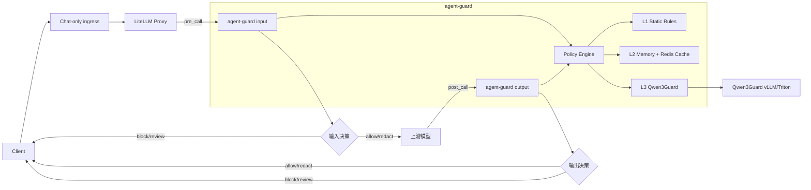

# LiteLLM + agent-guard + Qwen3Guard 输入输出安全控制方案

| 项目 | 内容 |
| --- | --- |
| 状态 | Draft（含当前实现记录） |
| 版本 | v0.4 |
| 日期 | 2026-09-26 |
| 范围 | 架构、当前实现边界与后续路线 |
| 网关 | LiteLLM Proxy |
| 安全服务 | agent-guard |
| 语义检测模型 | Qwen3Guard（后续 L3） |

> 当前 Chat 多客户端的代码实施以 [`chat-multi-client-adaptation-implementation.md`](chat-multi-client-adaptation-implementation.md) 为准；本文保留总体架构、L1/L2/L3、缓存、可观测性和生产化路线。

> 当前实现记录（2026-09-26）：Chat-only 入口、LiteLLM generic guardrail、agent-guard L1 Envelope/对齐校验、Chat 流式 `incremental_diff`、安全边界下的增量扫描均已落地并通过本机 HTTP 验收。Responses、Anthropic、Gemini 不属于当前交付范围。下一阶段重点是 `/v1/chat/completions` 下的多客户端 Profile 适配，而不是新增协议。

## 1. 文档目标

本文定义一个基于 Qwen3Guard 的 Agent 输入输出安全控制方案，覆盖：

- LiteLLM 如何在请求发送到上游模型前执行输入检测。
- LiteLLM 如何在模型响应返回客户端前执行输出检测。
- agent-guard 如何组织静态规则、缓存和 Qwen3Guard 语义分析。
- 检测结果如何转换为允许、阻止、脱敏或人工审核。
- 流式输出、工具调用、结构化输出和故障降级如何设计。
- 缓存版本、隐私保护、可观测性、测试和渐进上线要求。

本文用于后续拆分和实现 `liteLLM/` 与 `agent-guard/` 两个目录中的组件。

## 2. 核心判断

该方案整体可行，但需要明确以下原则：

1. **L1 静态规则和 L3 Qwen3Guard 是检测层。**
2. **L2 缓存层是判决复用和性能优化层，不是独立安全检测层。**
3. **缓存命中不能绕过 L1 硬拦截和策略优先级。**
4. **输出拦截不能只依赖完整响应结束后的 `post_call`，流式场景需要单独方案。**（实测：默认 `block_only` 下流式脱敏不生效，需 `incremental_diff`，见第 9 章）
5. **只检查文本消息不够，工具调用、工具结果和结构化参数也必须纳入控制面。**
6. **安全决策必须同步执行；审计、指标和异步分析可以旁路执行。**
7. **Qwen3Guard 是安全分类器，不应被视为通用 Agent 或自由推理模型。**

## 3. 目标与非目标

### 3.1 目标

- 对 Agent 输入和输出执行统一、可配置、可审计的安全判断。
- 对明显攻击使用低延迟静态规则拦截。
- 对重复内容复用历史判决，降低 Redis 和 Qwen3Guard 压力。
- 对语义风险、多语言内容和上下文相关风险使用 Qwen3Guard。
- 支持按租户、模型、路由和风险等级配置不同策略。
- 在 Redis 或 Qwen3Guard 异常时提供明确的降级策略。
- 为后续流式输出、工具调用和脱敏能力保留清晰扩展点。

### 3.2 非目标

- 不在本方案中实现完整的身份认证、授权、配额和计费系统。
- 不用文本护栏替代工具权限、沙箱、网络白名单和人工审批。
- 不保证对所有对抗性输入实现零绕过。
- 不在首期强制支持图片、音频、视频等多模态内容安全。
- 不在本方案中确定 Qwen3Guard 的具体部署硬件和模型规模。

## 4. 总体架构



### 4.1 请求主路径

1. 客户端请求进入 Chat-only ingress；入口只允许 `/v1/chat/completions` 和 `/v1/models`。
2. LiteLLM 后端仅监听回环地址。
3. LiteLLM 的输入 guardrail 调用 agent-guard。
4. agent-guard 执行 Envelope 对齐、L1，并在后续阶段接入 L2/L3。
5. 输入允许或被安全改写后，LiteLLM 调用上游模型。
6. LiteLLM 的输出 guardrail 调用 agent-guard 的输出检测入口。
7. agent-guard 判断是否允许、阻止、脱敏或转人工审核。
8. 最终结果返回客户端。

### 4.2 职责边界

| 组件 | 负责 | 不负责 |
| --- | --- | --- |
| LiteLLM | 路由、协议适配、调用 guardrail、阻止或替换响应 | 业务规则、缓存策略、安全分类模型 |
| agent-guard | 统一策略、三级流水线、判决融合、审计和指标 | 模型网关路由和上游模型调用 |
| Qwen3Guard | 语义安全分类和风险信号 | 最终业务策略、工具授权、身份授权 |
| Redis | 分布式缓存和版本化判决复用 | 权威安全策略存储 |
| 客户端 | 展示安全错误、处理拦截或审核状态 | 决定服务端安全策略 |

## 5. LiteLLM 网关设计

### 5.1 Guardrail 调用点

建议至少配置两个逻辑 guardrail：

- **输入 guardrail**：在调用上游模型前执行，映射到 agent-guard 的 `phase=input`。
- **输出 guardrail**：在模型响应返回客户端前执行，映射到 agent-guard 的 `phase=output`。

LiteLLM 常见 guardrail 模式包括 `pre_call`、`post_call`、`during_call` 和 `logging_only`，实际可用模式及行为必须以锁定的 LiteLLM 版本为准。

### 5.2 接入方式

优先评估 LiteLLM 的通用外部 guardrail API 或自定义 guardrail 能力：

- 仅 allow/block 的场景可优先使用标准 guardrail API。
- 需要修改消息、替换响应、脱敏、截断或改写 `tool_calls` 时，使用自定义 guardrail/callback。
- agent-guard 返回 200 且 `decision=block` 时，LiteLLM 将请求转换为统一的策略拒绝响应。
- agent-guard 网络错误、超时或协议错误属于运维错误，不应伪装成正常安全判决。

### 5.3 版本兼容性检查项

以下能力已经在当前锁定的 LiteLLM 版本中完成实测；新增客户端仍需补充夹具和回归：

- 输入与输出分别注册 guardrail。
- 对 `messages`、`response.content` 和 `tool_calls` 的访问。
- Chat 流式 `incremental_diff` 和 `stream_holdback_chars`。
- 修改请求或响应，而不只是抛出异常。
- 配置 guardrail 超时、失败模式和重试行为。
- 在日志和 trace 中关联同一个 `request_id`。
- 排除内部 Qwen3Guard 调用，避免递归触发 guardrail。

新增客户端仍必须验证其实际字段是否进入这些 LiteLLM 结构，并由 Profile 解释来源与轮次。

### 5.4 防止递归

如果 Qwen3Guard 使用 OpenAI 兼容接口，应遵循：

- agent-guard 直连 Qwen3Guard 的 vLLM/Triton 地址，不经过受保护的业务 LiteLLM 路由。
- 如果必须经过 LiteLLM，则使用专用内部模型路由并明确禁用 guardrail。
- 使用内部 token、mTLS 和网络策略限制访问。
- 禁止将 agent-guard 自身请求标记为普通用户流量。

## 6. agent-guard 服务设计

### 6.1 核心职责

- 接收 LiteLLM 传入的输入或输出检测请求。
- 标准化消息、响应、工具调用和上下文。
- 计算版本化缓存键。
- 执行 L1、L2、L3 流水线。
- 根据策略引擎融合检测结果。
- 返回统一决策、原因、风险类别和可选的脱敏内容。
- 输出结构化审计事件、指标和 trace。

### 6.2 建议内部模块

```text
agent-guard/
  api/             # HTTP 接口、鉴权、请求校验
  domain/          # 请求、响应、决策、风险类别等领域模型
  policy/          # 策略加载、版本、优先级和租户覆盖
  pipeline/        # L1 -> L2 -> L3 编排和短路逻辑
  detectors/       # rules、cache、qwen3guard 适配器
  sanitizer/       # 脱敏、替换、截断和安全改写
  storage/         # Redis、内存缓存、策略元数据
  observability/   # 日志、指标、trace、审计
```

### 6.3 统一检查接口

建议内部使用统一接口：

```http
POST /v1/guard/check
Content-Type: application/json
Authorization: Bearer <internal-token>
```

请求示例：

```json
{
  "request_id": "req-123",
  "trace_id": "trace-456",
  "tenant_id": "tenant-a",
  "user_id": "user-789",
  "phase": "input",
  "model": "gpt-4.1-mini",
  "policy_id": "default-agent-policy",
  "messages": [
    {"role": "user", "content": "..."}
  ],
  "response": null,
  "context": {
    "channel": "chat",
    "stream": false,
    "locale": "zh-CN",
    "conversation_id": "conv-001"
  },
  "metadata": {
    "route": "/v1/chat/completions",
    "client_app": "internal-agent"
  }
}
```

输出检测请求中，`response` 可包含：

```json
{
  "content": "assistant text",
  "tool_calls": [
    {
      "id": "call-1",
      "type": "function",
      "function": {
        "name": "http_request",
        "arguments": "{\"url\":\"https://example.com\"}"
      }
    }
  ]
}
```

响应示例：

```json
{
  "decision": "allow",
  "risk_level": "safe",
  "categories": [],
  "score": 0.02,
  "sanitized": null,
  "reason_codes": ["l3_safe"],
  "layer_trace": ["l1_miss", "l2_miss", "l3_allow"],
  "policy_version": "2026-09-21.1",
  "detector_versions": {
    "normalizer": "1",
    "rules": "2026-09-21.1",
    "qwen3guard": "model-revision-fixed"
  },
  "cache": {
    "status": "miss",
    "store": null
  },
  "latency_ms": {
    "total": 83,
    "l1": 1,
    "l2": 3,
    "l3": 72
  },
  "trace_id": "trace-456"
}
```

### 6.4 HTTP 语义

- 检测成功并得到安全判决：返回 `200`，即使 `decision=block`。
- 请求格式错误：返回 `4xx`。
- 内部鉴权失败：返回 `401/403`。
- Qwen3Guard、Redis 等依赖故障：按策略返回明确错误或降级判决，并记录原因。
- 响应必须始终包含 `request_id`、`trace_id`、`policy_version` 和 `decision`。

## 7. 三层检测流水线

### 7.1 L1：静态正则与关键字层

定位：**高精度、低延迟、确定性的第一道防线。**

适用内容：

- 已知高置信攻击特征。
- 系统提示词泄露特征。
- API Key、Token、密码、私钥等秘密模式。
- 手机号、身份证号、邮箱、银行卡等可配置 PII 模式。
- 危险工具参数、明显外联 URL 或危险命令模式。
- 租户特有的禁用词、业务敏感词和黑名单。

设计建议：

- 在规则匹配前执行 NFKC、大小写折叠、全角转半角、零宽字符移除、空白折叠和有限 URL/HTML 实体解码。
- 归一化视图和原始视图分别保留规则，避免过度归一化导致误报。
- 优先使用高精度规则，不要把大量敏感主题词堆进关键字黑名单。
- 规则按方向、租户、模型组、渠道和风险类别分区。
- 规则配置必须版本化、可回滚、可审计。
- 正则必须进行静态审查、长度限制和超时保护。
- 对单次请求设置最大字符数和最大消息数。

建议动作：

- `hard_block`：直接拒绝。
- `redact`：脱敏后继续后续检测。
- `suspicious`：不直接拒绝，交给 L2/L3。
- `allow`：允许继续。

### 7.2 L2：内存 + Redis 缓存层

定位：**缓存已有安全判决，降低 Qwen3Guard 成本和端到端延迟。**

#### 7.2.1 两级缓存

- **进程内内存缓存**：低延迟、小容量、短 TTL，适合热点重复内容。
- **Redis 缓存**：跨实例共享、容量更大、TTL 可控，适合稳定判决复用。

建议缓存优先级：

1. 先查询内存缓存。
2. 未命中时查询 Redis。
3. Redis 命中后回填内存缓存。
4. 最终 L3 检测完成后，按策略写入 Redis 和内存缓存。

#### 7.2.2 缓存键

缓存键必须包含影响判决的所有版本维度：

```text
cache_key = SHA256(
  tenant_id
  + phase
  + model_group
  + policy_version
  + rules_version
  + normalization_version
  + qwen_model_revision
  + direction_specific_context_hash
)
```

上下文哈希应使用服务端密钥进行 HMAC，不应直接存放用户原文。对于多轮对话，至少纳入相关历史摘要；如果无法可靠摘要，应减少跨上下文缓存复用。

#### 7.2.3 TTL 和可缓存范围

| 判决 | 建议缓存策略 |
| --- | --- |
| safe / allow | 可缓存，TTL 按场景设置 |
| unsafe / block | 可短时缓存，避免重复攻击，但必须带版本 |
| redact | 只有脱敏结果确定且可复现时才缓存 |
| review / uncertain | 默认不缓存 |
| 依赖真实用户身份或实时数据的判决 | 默认不缓存或按用户分区 |
| 缓存策略或模型 revision 已变化 | 视为未命中 |

具体 TTL 不写死在代码中，应由策略配置控制。例如内存缓存可为分钟级，Redis 可为分钟到小时级；最终值需基于误报影响、隐私要求和流量特征确定。

#### 7.2.4 安全和一致性

- 禁止信任客户端提交的缓存键。
- 使用 `tenant_id` 严格隔离租户。
- 不缓存包含敏感原文的调试字段。
- 使用版本化命名空间，策略升级时切换命名空间，而不是逐条删除。
- 对热点失效使用 single-flight，避免缓存击穿。
- 缓存写入只允许发生在完整流水线成功后。
- Redis 故障时降级到内存或直接进入 L3，不能因此放行已命中 L1 的硬拦截。

### 7.3 L3：Qwen3Guard 语义分析层

定位：**语义、上下文和多语言风险的检测层。**

建议能力：

- 输入检测：提示注入、越狱、危险意图、数据外泄意图和上下文绕过。
- 输出检测：不安全内容、敏感信息泄露、系统提示词泄露和不当工具调用。
- 使用 Gen 模型处理完整输入/输出分类。
- 对流式输出评估 Stream 模型或等价的 token/chunk 检测方案。
- 首期可用较小模型承担大部分流量，边界样本升级到更大模型。
- 在同一 layer 内可以建立 `0.6B/4B/8B 类` 的分级模型策略，但具体规模以实际部署和评测为准。

模型调用原则：

- 使用固定模板和结构化输出协议。
- 将被检测文本视为不可信数据，不能让它改变分类器指令。
- 输入检测和输出检测使用不同提示模板。
- 输出检测应提供必要的原始用户意图或对话摘要，避免脱离上下文。
- 禁止给 Qwen3Guard 工具权限、网络权限或可执行动作。
- 对模型输出做严格解析；解析失败进入明确故障路径，不得默认放行。
- 记录模型 revision、量化版本和推理参数。
- Qwen3Guard 应直连独立的 vLLM/Triton 服务，避免通过受保护业务网关递归调用。

## 8. 决策引擎

### 8.1 决策类型

- `allow`：原请求或原响应允许继续。
- `block`：拒绝请求或响应。
- `redact`：返回安全改写后的内容。
- `review`：转人工审核或进入隔离队列。

内部还可以保留 `degrade` 或 `error` 状态，但对外应转换为上述四类之一，避免 LiteLLM 适配层理解过多内部状态。

### 8.2 建议优先级

| 条件 | 默认动作 |
| --- | --- |
| L1 硬规则命中 | `block`，不再查询缓存或 L3 |
| L1 脱敏规则命中 | 生成脱敏候选，再继续必要的 L3 检测 |
| 缓存命中且版本一致 | 应用缓存判决，但 L1 硬拦截优先 |
| L3 safe 且低于阈值 | `allow` |
| L3 controversial 或接近边界 | 按租户策略 `redact/review/block` |
| L3 unsafe 且高于阈值 | `block` |
| 输出包含工具调用 | 同时执行工具参数策略和工具能力策略 |
| 依赖故障 | 按路由风险执行明确降级策略 |

Qwen3Guard 的分数只作为风险信号，不应直接等同于最终业务动作。不同风险类别应有独立阈值，不同租户、渠道和用户群体也可以有覆盖策略。

### 8.3 输入和输出策略分离

| 方向 | 重点检测项 |
| --- | --- |
| 输入 | 提示注入、越狱、危险意图、敏感数据上传、系统信息探测、工具滥用意图 |
| 输出 | 不安全内容、隐私泄露、秘密泄露、系统提示词泄露、错误工具调用、外联和数据泄露 |

输入安全不代表输出安全，输出安全也不代表原始输入意图安全。两者必须分别记录和评测。

## 9. 流式输出设计

### 9.1 问题

如果 LiteLLM 只能在完整响应结束后执行 `post_call`，那么流式响应可能在检测前已经将内容发送给客户端。被拦截时，不安全前缀可能已经泄漏。

实测确认了这一点：默认的 `block_only` 下 guard 即使返回改写后的 `texts`，客户端仍收到明文，等于“只拦不改”。

### 9.2 可选策略

下表是通用取舍清单；当前 `/v1/chat/completions` 已选定并实测 `incremental_diff`，Responses/Anthropic 不在本期承诺范围。

| 策略 | 优点 | 缺点 | 适用场景 |
| --- | --- | --- | --- |
| 高风险路由禁用流式 | 实现简单、控制强 | 用户体验变差 | 高风险业务、首期版本 |
| 完整生成后检测再发送 | 无前缀泄漏、规则简单 | 首字延迟高 | 高风险但可接受延迟 |
| 按句/块缓冲检测 | 平衡延迟和安全性 | 仍有有限泄漏窗口 | 一般业务 |
| Qwen3Guard-Stream 或 chunk 检测 | 窗口更小 | 实现和部署复杂 | 大规模流式场景 |

### 9.3 当前实现与下一阶段建议

实测结论（LiteLLM 1.102.0 + agent-guard，证据与脚本见 `tools/`）：

- 默认 `block_only` 下**脱敏不会到达客户端**：流式场景的改写必须显式配置才生效。
- `streaming_transform_mode: incremental_diff` 可由配置开启（`generic_guardrail_api` 会透传 `streaming_*`），这是当前唯一能让流式脱敏真正生效的杠杆。
- `streaming_buffer_until_moderated` 属 Bedrock 专用，`generic_guardrail_api` 未透出，**无法通过配置开启**。
- 旧的单项 5 万字符上限会导致 413；当前 Chat 输出使用独立输出上限，超过上限返回策略拦截，而不是把 413 冒泡成无保护断流。

当前实现与后续建议：

- `/v1/chat/completions` 已开启 `incremental_diff`，guard 返回 `stream_holdback_chars`，并在安全边界下复用流式前缀扫描结果。
- 对 PEM、编码、Unicode、非追加式内容或缺少稳定调用 ID 的情况，回退全量扫描。
- Chat-only 入口负责隔离 Responses 等未验收路由。
- 下一阶段对 DSH、OpenCode、Claude Code 等 Chat 客户端分别做 Profile 和流式回归。
- 在文档和客户端协议中明确：超时、拒绝、截断和审核状态的处理方式。

详细设计与排期见 [`protocol-adapter-design.md`](protocol-adapter-design.md) 第 9 章与第 12 章（协议适配优先级 P1）。

## 10. 工具调用、结构化数据和多模态

### 10.1 工具调用

需要检查：

- 工具名称是否在允许列表。
- 参数 JSON 是否格式正确。
- shell、SQL、HTTP、文件、邮件和数据库参数是否符合策略。
- URL 是否用于数据外泄或访问受限资源。
- 多步工具调用组合是否形成越权操作。
- 工具结果中是否包含间接提示注入。

### 10.2 结构化输出

JSON、XML、代码块和 Markdown 链接不能只作为纯文本处理。建议：

- 保留原始结构，同时提取可检测文本。
- 对 JSON Schema、字段名和值分别执行策略。
- 对代码和命令行内容增加专用规则。
- 对 URL、域名、IP 和文件路径进行规范化后再检测。

### 10.3 多模态

Qwen3Guard 主要是文本安全模型。若后续需要图片、音频或视频：

- 先使用 OCR、ASR 或视觉安全服务转换为文本或风险标签。
- 将模态来源和转换器版本纳入缓存键。
- 不要未经声明地把多模态内容当成普通文本处理。
- 首期可以明确拒绝或降级处理不支持的多模态路由。

## 11. 安全模型

### 11.1 主要威胁

- 直接提示注入和越狱。
- 通过工具结果、网页或 RAG 文档进行的间接提示注入。
- Unicode、同形字、零宽字符、编码和分词绕过。
- 多语言和混合语言绕过。
- 敏感信息、秘密和系统提示词泄露。
- 恶意工具调用、数据外泄和权限提升。
- 缓存污染、跨租户缓存串用和版本回退。
- Qwen3Guard 被输入内容误导或输出解析失败。

### 11.2 信任边界

- 用户内容不可信。
- 工具结果不可信。
- RAG 文档不可信。
- LiteLLM 到 agent-guard 的内部调用必须认证。
- agent-guard 到 Qwen3Guard 的内部调用必须认证和隔离。
- 策略配置属于高权限资产，不作为普通运行时数据。

## 12. 故障与降级

| 故障 | 建议行为 |
| --- | --- |
| L1 规则引擎异常 | 高风险路由 fail-closed；低风险路由按策略降级并告警 |
| 内存缓存异常 | 绕过内存缓存，继续 Redis/L3 |
| Redis 异常 | 降级到内存或直接进入 L3，不阻塞基本检测 |
| Qwen3Guard 超时 | 高风路由默认阻止或转审核；低风路由按显式策略降级 |
| Qwen3Guard 连续失败 | 触发熔断，避免拖垮 LiteLLM |
| agent-guard 不可用 | 高风路由 fail-closed；普通路由按租户策略决定 |
| 解析结果异常 | 不默认 allow；进入 review 或受控降级 |
| LiteLLM guardrail 超时 | 采用明确的请求级 timeout 和降级策略 |

故障策略必须按路由、租户和数据敏感级别配置，不能全局固定为 fail-open 或 fail-closed。

## 13. 隐私、合规和审计

- 默认不记录完整原文；只记录哈希、长度、风险类别和规则 ID。
- 必须保存原文时，应使用加密、最小权限、短保留期和访问审计。
- Redis 中优先保存 HMAC 指纹和判决，不保存原始用户内容。
- 日志中避免记录 API Key、Token、密码、身份证号和完整工具参数。
- 明确数据驻留、跨境传输和保留期限。
- 策略、模型 revision、规则版本和判决必须可以追溯。
- 审计事件应包含 `request_id`、`trace_id`、方向、租户、判决、原因和版本，不应包含不必要的敏感内容。

## 14. 可观测性

### 14.1 指标

- 请求总数、允许、阻止、脱敏、审核数量。
- 输入和输出方向的拦截率。
- L1、L2、L3 命中率。
- 内存缓存和 Redis 命中率。
- 各层 P50、P95、P99 延迟。
- Qwen3Guard 调用量、超时率和错误率。
- 规则误报率、规则命中趋势和策略版本分布。
- 缓存失效、版本切换和降级事件。
- 每千次请求的 GPU 成本和 token 成本（如适用）。

### 14.2 日志和 trace

- 每条日志必须能关联 `request_id` 和 `trace_id`。
- 记录 `layer_trace`，明确是规则、缓存还是模型决定。
- 记录 `policy_version`、`rules_version` 和 `qwen_model_revision`。
- 不向普通客户端暴露具体绕过细节，只返回稳定错误码和请求 ID。
- 内部分析可以使用脱敏后的样本和受控审计记录。

## 15. 性能与容量目标

在下一阶段多客户端 Profile 和后续 L2/L3 实施前，需要确定以下预算：

- LiteLLM 引入的额外 P95 延迟。
- L1 的目标 P95 延迟。
- Redis 的目标 P95 延迟。
- Qwen3Guard 小模型和大模型的目标 P95 延迟。
- 每秒请求数、并发会话数和流式连接数。
- GPU 显存、批处理能力和峰值冗余。
- 缓存命中率和可接受的缓存成本。
- 超时、重试、熔断和降级阈值。

性能目标应与模型规模、量化和硬件绑定。较大的 Qwen3Guard 模型不应该默认用在所有请求上，建议使用小模型快速筛查、边界样本升级的分级策略。

## 16. 部署拓扑

建议部署为：

```text
Client
  -> LiteLLM Proxy
  -> agent-guard
  -> Memory Cache
  -> Redis
  -> Qwen3Guard vLLM/Triton
  -> Upstream LLM
```

部署要求：

- LiteLLM 和 agent-guard 使用独立服务边界。
- agent-guard 无状态实例可以使用内存热点缓存，但权威共享缓存放在 Redis。
- Qwen3Guard 使用独立 GPU 资源池，不与通用推理模型抢占资源。
- 所有内部通信使用 mTLS 或等价的服务认证。
- 网络策略限制 agent-guard 和 Qwen3Guard 的访问范围。
- 策略版本和模型 revision 可通过配置中心或发布流程管理。
- 先支持非流式，再逐步引入流式路径。

## 17. 两个工作目录的职责

### 17.1 `liteLLM/`

后续应承载：

- LiteLLM Proxy 配置。
- 输入和输出 guardrail 注册。
- agent-guard 适配器和请求转换。
- block/redact/review 与 LiteLLM 响应的映射。
- 内部 Qwen3Guard 路由的递归排除配置。
- 网关侧的集成测试和部署配置。

不应承载：

- 正则规则库。
- Qwen3Guard 推理实现。
- 复杂业务策略和缓存逻辑。

### 17.2 `agent-guard/`

后续应承载：

- 统一检查 API。
- 请求/响应领域模型。
- 策略引擎和版本管理。
- L1 规则检测器。
- 内存和 Redis 缓存。
- Qwen3Guard 适配器。
- 脱敏和人工审核扩展点。
- 指标、日志、审计和测试。

## 18. 测试策略

### 18.1 单元测试

- 规则归一化、匹配和边界条件。
- 缓存键、TTL、版本切换和租户隔离。
- 决策优先级和策略覆盖。
- Qwen3Guard 输出解析和错误处理。
- 脱敏结果的幂等性和可复现性。

### 18.2 集成测试

- LiteLLM 输入 guardrail 在模型调用前执行。
- 模型调用因输入 block 被阻止时不会访问上游。
- 输出 guardrail 在响应返回客户端前执行。
- 自定义响应修改和 `tool_calls` 处理符合 LiteLLM 版本能力。
- agent-guard 不可用时的 LiteLLM 行为符合配置。

### 18.3 对抗测试

建立持续回归集，覆盖：

- 直接提示注入和越狱。
- 间接提示注入。
- 多语言、混排、编码和同形字绕过。
- 工具滥用和数据外泄。
- 敏感信息、秘密和系统提示词泄露。
- 误报基准和正常业务语料。

### 18.4 压测与混沌测试

- L1、Redis、Qwen3Guard 分别超时。
- Redis 整体不可用。
- Qwen3Guard 部分实例失效。
- guardrail 调用延迟超过 LiteLLM timeout。
- 高并发重复请求和缓存击穿。
- 模型 revision 或策略版本切换。

## 19. 分阶段实施建议

> 本节用 M0–M2 描述里程碑范围；当前执行以 Chat-only 的 P0/P1 收尾和下一阶段多客户端 Chat Profile 适配为准。Responses/Anthropic/Gemini 不纳入当前客户端闭环。

### M0：Chat-only L1 安全链路（已完成）

- Chat-only ingress + 回环 LiteLLM。
- LiteLLM 输入 `pre_call` 和输出 `post_call`。
- L1 静态规则和 LiteLLM 动作映射。
- `NONE`、`BLOCKED`、`GUARDRAIL_INTERVENED` 三类主要动作。
- `request_id`、`trace_id`、规则版本和层命中记录。
- Redis、Qwen3Guard、shadow 误报观察和人工审核仍属于后续能力。

### M1：Chat 多客户端闭环（下一阶段）

- 冻结 DSH、OpenCode、Claude Code 等实际使用 Chat 的客户端夹具。
- 建立 `generic_chat`、`dsh_chat`、`opencode_chat`、`claude_code_chat` 等 Profile。
- 按请求结构/header 解析客户端来源、runtime context、RAG、工具调用和工具结果。
- 为每个 Profile 建立对齐、当前轮、历史攻击、工具链、非流式脱敏和流式脱敏契约测试。
- 识别不确定时 strict/fail-closed，不靠客户端名称或内容前缀猜测。

### M2：生产强化与后续协议

- Qwen3Guard-Stream 或更细粒度流式检测。
- 多模态预处理。
- 高级政策、风险画像和自动红队回归。
- 更精细的成本、容量和模型校准。

## 20. 待确认决策

在开始编码前需要确认：

1. 目标 Chat 客户端清单、真实路由和脱敏后的请求夹具。
2. 每个客户端是否发送完整历史、工具结果和 runtime context。
3. 各客户端的 Profile 识别信号、版本和回滚方式。
4. 工具结果默认 block 还是 quarantine，以及哪些内容可改写。
5. Qwen3Guard 的模型规模、量化方式和 GPU 资源。
6. 可接受的输入和输出 P95 额外延迟。
7. 哪些路由允许 fail-open，哪些必须 fail-closed。
8. 多租户策略、数据隔离和审计保留期限。
9. 是否支持多模态，以及不支持的模态如何降级。
10. 策略、规则和模型的发布、回滚与审批流程。

## 21. 验收标准

方案实现完成后，至少应满足：

- 输入硬拦截在调用上游模型前生效。
- 输出决策在响应交付前生效，或明确采用可接受的流式泄漏窗口。
- L1、L2、L3 的判决可以解释并追溯。
- 规则、策略、缓存和模型版本变化可以使旧判决失效。
- Redis 或 Qwen3Guard 故障时行为可预测、可观测、可配置。
- 工具调用和结构化输出不会被完全绕过。
- 原始内容默认不进入普通日志或缓存。
- 具备对抗测试、误报基准、压测和回滚方案。
