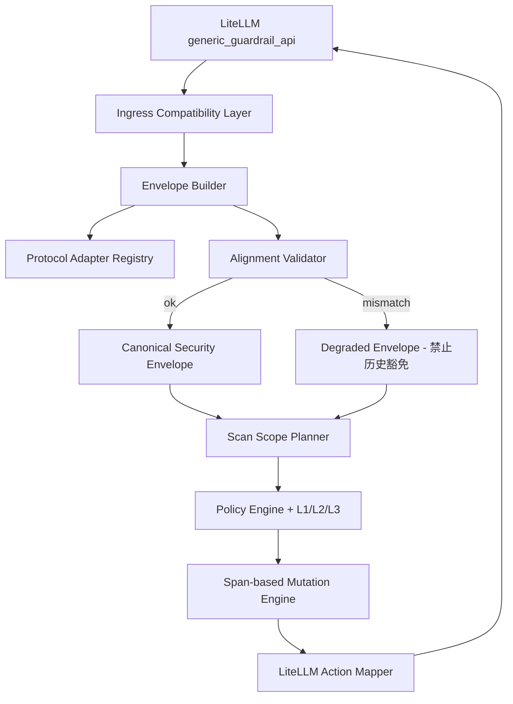

# 多协议输入输出适配设计（Protocol Adapter Design）

| 项目 | 内容 |
| --- | --- |
| 状态 | Proposed |
| 版本 | v0.4 |
| 日期 | 2026-09-26 |
| 范围 | 协议适配规范与落地优先级，不包含代码实现 |
| 固定上游 | LiteLLM Proxy `generic_guardrail_api` |
| 关键约束 | 不修改 LiteLLM 代码，修复集中在 agent-guard |

> 本期范围决策（2026-09-26）：**只对客户端 `/v1/chat/completions` 作 P0/P1 安全验收和承诺；`/v1/responses` 后续适配，不作为本期交付条件。** 已有 Responses 代码和测试是预研，不等于完整支持。本期提供 `liteLLM/serve_chat_only.py` 作为路由隔离入口；`config.yaml` 本身不封禁 Responses，直接暴露 LiteLLM 后端不属于本期安全部署。下文 F6 与 Responses 适配规则保留作为后续设计，旧版“OpenAI 家族均属 P0”的措辞以本决策及第 12–14 章更新为准。

> 实施记录（2026-09-26）：本文仍保留为设计规范。P0 的 guard 侧 A0/A1 与 P1 的 Chat S1、10 万字符有界扫描/超限策略拦截已实现；进程内协议矩阵和 Chat 流式真实 Proxy SSE 测试通过。但 Responses 只有工具项、没有可提取文本时，当前 LiteLLM 翻译层直接跳过 guard（`tools/protocol_matrix.py` 记录为 `KNOWN GAP`）；S2 已增加按调用 ID 的保守增量扫描：只有安全逗号边界可复用前缀，其余回退全量；Chat-only 入口下真实 HTTP 的 10 万字符带密钥流已通过。Responses 子集测试仍不属于本期协议承诺。

本文承接 [`agent-guard-multi-client-design.md`](agent-guard-multi-client-design.md) 第 6 章（目标架构）、第 7 章（Canonical Context Model）、第 10/11 章（Scan Scope 与规则适用模型），把“协议差异”这一层写成可实现的规范。

- 适用对象：**下游边界**上的请求形态——本期 OpenAI Chat Completions；OpenAI Responses API 后续适配（A2A 与 DSH/pi-ai 类自有客户端仍须按实际线格式分类）；Anthropic Messages 预留；Gemini generateContent 不接入。上游部署协议不在范围内（见第 0 节）。
- 被解决的问题：LiteLLM 只保证“传输层归一化”，不保证“语义归一化”。当前 L1 实现把两者混在一起，靠数组下标对齐，导致协议不同则行为不同。
- 不在本文范围：L2/L3 检测器、多租户策略存储、规则内容本身。
- 设计约束：**不修改 LiteLLM 代码**，改动集中在 guard 服务内。LiteLLM 的配置文件（`liteLLM/config.yaml`）属我方资产，可以调整；fork 或改动 LiteLLM 源码不在本方案内。

v0.3 变更：记录决策 1（`system` / `developer` 信任策略）与决策 2（流式首字延迟按默认值），第 14 章拆为“已定决策 / 开放问题 / 验收标准”，第 13 章矩阵同步更新 system 一行。

v0.2 变更：新增第 0 节“两层协议边界”；第 1.1 节与第 12 章按当前使用场景重排优先级；Anthropic 降为预留、Gemini 移出验收矩阵。

## 0. 前置说明：两层协议边界

本项目里“协议”有两层，guard 只与其中一层打交道。

**上游层：LiteLLM → 真实模型。** 上游可能是 vLLM、SGLang、Azure、Bedrock、供应商官方 API 等任意形态，也可能是我们并不知情的自建部署。这一层对 guard **不可见，也不需要可见**：LiteLLM 在调用 guard 之前已经把请求归一化到自己的 OpenAI 形状。因此 guard 不承担上游协议适配，也不为上游差异增加回归项。

**下游层：客户端 → LiteLLM。** LiteLLM 以 OpenAI 兼容协议对外提供服务，guard 收到的就是这一层的原样请求。这是本文唯一需要适配的边界。

由此得到三个必须写清楚的结论：

1. **“OpenAI 兼容”是一个家族，不是一种协议。** 当前客户端至少产生两种结构不同的请求形态：
   - **Chat Completions**：`messages[]`，role 为 system / developer / user / assistant / tool。DSH 类客户端走这条。
   - **Responses API**：`instructions` + `input[]`，其中含 `function_call` / `function_call_output` item。Codex 类客户端走这条。
   两者在 LiteLLM 的 ingress 字段结构不同（见 2.2 的 F6）；本期只验收 Chat，后续启用 Responses 时必须分别解释，不能共用一套下标逻辑。
2. **上游协议不构成风险，下游方言构成风险。** 我们不需要知道模型怎么部署，只需要知道客户端发来的 `instructions`、`function_call_output` 落在哪个字段。
3. **输入形状是封闭的小集合。** 只要 LiteLLM 未开启直通路由、本期客户端只调用 `/v1/chat/completions`（后续才考虑 `/v1/responses`），guard 需要处理的形态就固定为下表——这是本文全部设计的前提。

| 形态 | 来源 | 本文定位 |
| --- | --- | --- |
| OpenAI Chat Completions | 客户端 `messages[]` | 主场景（优先级见 1.1） |
| OpenAI Responses API | 客户端 `instructions` + `input[]` | 后续适配；本期不承诺 |
| Anthropic Messages | 直通路由 | 预留（R1），仅在确有客户端使用时启用 |
| Gemini generateContent | 直通路由 | 不接入，仅登记缺口 |
| 上游部署协议 | LiteLLM 内部 | 不适用，guard 不可见 |

**例外与前提**：若 LiteLLM 对外暴露了直通路由（如 `/anthropic/v1/messages`、`/gemini/...`），请求会绕过归一化，guard 将看到非 OpenAI 形状的原生请求。此时按第 7 章的协议识别处理，识别不出即 `degraded`（6.4）。

## 1. 结论先行

1. **不接受“靠下标对齐”**。所有判定必须基于显式来源（`origin_ref`）和稳定 ID，数组下标只作为调试信息保留。
2. **归一化分两层**：LiteLLM 负责传输层（协议 → OpenAI 规范 messages，已存在），agent-guard 负责语义层（OpenAI 规范 messages → Canonical Security Envelope）。两层之间的对齐必须**校验**，不能假设。
3. **改写必须回写到原文坐标系**。检测可以在归一化视图上做，回写必须落到原始文本的 span，禁止用归一化后的整串文本覆盖原文（当前 `redaction_view` 的行为）。
4. **模糊即 fail-closed**。来源、轮次或可变性无法确定时，不允许静默降级为“历史豁免”，也不允许返回 `allow`。
5. **输出侧按协议分别建模**：主场景是 OpenAI Chat 的流式改写（P1，见 9.2），非 OpenAI Chat 的流式改写暂不承诺。
6. **修复全部落在 guard 服务内**：不可及能力（第 11.3 节）显式记录并给出缓解方案，不以“改上游”为实现手段。

### 1.1 范围与执行优先级（v0.2 重排）

| 分类 | 协议 / 场景 | 处理方式 |
| --- | --- | --- |
| 本期主场景 | `/v1/chat/completions`，输入 + 流式文本输出 | P0/P1 的唯一默认验收路由；按实际路由确认客户端，不按名称推断 |
| 后续适配 | `/v1/responses` | 已有局部实现与测试，但纯工具项请求可能绕过 guard；本期不承诺，接入前须另行验收 |
| 次场景 | OpenAI Chat 非流式输出 | 现状已可用，仍需 span 回写（A4） |
| 预留 | Anthropic Messages | 使用量预计很少或不用；不投入专门设计，靠通用修法覆盖，启用时按第 13 章矩阵回归（R1） |
| 不接入 | Gemini generateContent | 可预见未来不使用：只登记为已知缺口，不做适配，也不做缓解设计 |
| 不适用 | 上游部署协议（vLLM / SGLang / Azure / Bedrock / 供应商 API） | guard 不可见：LiteLLM 已完成归一化（第 0 节），不按上游分别适配或回归 |

执行优先级（重排依据见 12.1）：

| 优先级 | 范围 | 内容 | 阶段 |
| --- | --- | --- | --- |
| **P0** | Chat Completions 输入侧 | 对齐校验 + `degraded` 语义；结构化字段补扫 | A0、A1 |
| **P1** | Chat Completions 流式文本输出侧 | 流式脱敏真正生效；流式体积治理（禁止 413 断流） | S1、S2 |
| **P2** | 客户端识别 | DSH 类 synthetic 尾部按 Profile 识别，取消固定前缀白名单 | A2 |
| **P3** | 工具链与改写质量 | 工具结果策略；span 双视图回写 | A3、A4 |
| **P4** | 残余风险文档化 | 输出侧 `tool_call` 缺口 + 路由前置条件 | S3 |
| **R1** | 预留协议 | Anthropic 按需启用（A0–A4 的通用修法已覆盖其输入侧） | R1 |

推论：

- **P0 + P1 是最小安全闭环**：输入判得准 + 流式输出不泄漏。这两项完成前，不应对外承诺“输入输出均已防护”。
- 本期验收矩阵只以 Chat Completions 为准（第 13 章）；Responses 与 Anthropic 为后续/预留，Gemini 不接入。
- 本期重点是 **Chat 输入判定正确性**（A 系列）与 **Chat 流式文本输出防护**（S 系列）；Responses 不因复用通用代码而自动进入承诺范围。
- 上游部署协议不占优先级：不写缓解、不做回归，避免把不可见的差异当成自己的工作量。
- Gemini 的已知缺口继续在本文记录，避免以后接进来时当成新发现。

## 2. 实测的协议差异（问题证据）

以下均为在真实 LiteLLM 1.102.0 翻译层 + 真实 agent-guard 上实测的结果（脚本见 `tools/`）。

### 2.1 归一化确实存在，但不完整

| 协议 | `structured_messages` | `texts` | 顶层 `tool_calls` |
| --- | --- | --- | --- |
| OpenAI Chat | 原样透传（OpenAI 规范） | 按消息顺序抽取 | 由消息内 `tool_calls` 提升 |
| OpenAI Responses | `input`/`instructions` → chat messages | 抽取 | 有 |
| Anthropic Messages | 翻译为 OpenAI 规范，但 `content` 仍是 block 列表 | 抽取（顶层 `system` **不**进 texts） | **不提升** |
| Gemini generateContent | **不下发** | 抽取 | 无 |
| DSH 类自有客户端 | 折叠后的 `role=user` 序列 | 抽取 | 视实现 |

### 2.2 由差异导致的实际缺陷（F1–F6）

> 编号说明：`F1–F6` 是实测缺陷编号（finding）；第 12 章的 `P0–P4` 是执行优先级。两者是不同系列，不要混用。

| 编号 | 现象 | 根因 |
| --- | --- | --- |
| F1 | Anthropic + 顶层 `system` 时，最新用户消息的 `prompt_injection` 从 `BLOCKED` 降级为 `GUARDRAIL_INTERVENED`（只替换历史、请求放行） | `structured_messages` 含 `system`，`texts` 不含 → 下标错位一位，最新用户下标算成 1，finding 来源是 `texts[0]` |
| F2 | Anthropic `tool_use.input` 里的 `rm -rf /` 完全漏检（判决 `NONE`） | `tool_use.input` 既不在 `texts` 也不在顶层 `tool_calls`；`texts` 非空时 `structured_messages` 被整体忽略 |
| F3 | Gemini 路径多轮对话中，历史注入反复硬拦新消息（**当前不使用该协议**，仅记录） | Gemini 不下发 `structured_messages` → 无法区分历史与当前轮 → 全量按当前轮处理 |
| F4 | Anthropic/Responses/Gemini 的流式脱敏无法启用 | `streaming_transform_mode=incremental_diff` 被限制为 OpenAI Chat handler |
| F5 | `role=tool` / `tool_result` 中的注入只替换、不拒绝 | 非 `user` 角色一律落入历史分支；而工具结果是间接注入的主要入口 |

**F6（OpenAI 家族内部）**：同为 OpenAI 协议，Chat Completions 与 Responses API 的 ingress 行为不同——Responses 的 `instructions` 变成 system 消息但不进 `texts`（索引错位，与 F1 同型）、`function_call` 参数只进 `structured_messages[].tool_calls`、`function_call_output` 只进 `structured_messages[]` 而不进 `texts`。实测：Codex 类的“当前轮注入”被降级为替换、危险 shell 命令与工具输出注入均漏检。

对照：OpenAI Chat 路径下 F1 不出现（`texts` 与 `structured_messages` 同时包含 `system`，下标天然一致）；但 `structured_messages[].tool_calls` 同样只在顶层 `tool_calls` 被提升时才会被扫到。

## 3. 业界参考与取舍

| 项目 | 做法 | 采纳 | 不采纳 / 差异 |
| --- | --- | --- | --- |
| Microsoft Presidio | Analyzer 只产出 `(entity, start, end, score)`，Anonymizer 依据 span 在**原文**上做替换 | ✅ 检测与改写分离；span 回写原坐标系 | 不引入其 NLP 引擎 |
| Protect AI LLM Guard | Input/Output 两套 scanner 管线；`Vault` 保存占位符↔原文映射以支持还原；流式用缓冲 | ✅ 双管线 + 占位符映射 + 高风险流式缓冲 | Vault 还原会增加泄漏面，默认不启用还原 |
| NVIDIA NeMo Guardrails | Input/Output rails + 独立的 `$context` / 工具结果通道；Colang 显式声明 | ✅ 上下文与用户输入在模型层就分开 | 不引入 Colang DSL |
| Guardrails AI | 自有 canonical `messages`（system/developer/user/assistant/tool + `tool_call_id`），不支持的输入走 pass-through | ✅ 定义 canonical message 模型 + 显式 pass-through | 不使用其 validator hub |
| LangChain / Vercel AI SDK | 统一的 `BaseMessage`/`CoreMessage` + 每 provider 一个 converter；未知字段落 `additional_kwargs` | ✅ “canonical + per-provider converter + 逃生字段” 结构 | 不引入其运行时 |
| Azure Prompt Shields | 显式区分 `userPrompt` 与 `documents`，不靠推断 | ✅ 来源显式化优先于内容猜测 | — |
| AWS Bedrock Guardrails | `source=INPUT\|OUTPUT` + qualifiers（query/guard_content） | ✅ phase/source 作为一等参数 | — |
| OpenTelemetry GenAI semconv | 跨厂商的消息/角色语义约定 | ✅ 作为 canonical role 词表来源 | — |
| LiteLLM `BaseTranslation` | 每个 endpoint 一个 handler：`get_structured_messages` + `process_input_messages` / `process_output_response` | ✅ 沿用其边界（我们只消费其输出，并校验） | 不依赖其内部对齐假设 |

业界共性结论：**canonical 中间表示 + 每协议 converter + 显式来源/span + 不支持即显式降级**。没有一家靠“数组下标对齐”或“内容形态猜测”来判断来源。

## 4. 设计原则

1. **显式来源优于内容猜测**：来源取不到就标 `unknown`，由策略决定，而不是靠 role 或文本形态推断。
2. **稳定 ID 优于数组下标**：所有 mutation 通过 `item_id` 表达。
3. **双视图**：`raw`（原文，唯一可回写对象）与 `view`（归一化视图，唯一可匹配对象）严格分离。
4. **单点归一化**：协议 → canonical 的转换只在一个组件里发生，规则层不再感知协议。
5. **模糊即 fail-closed**：对齐校验失败、来源未知、内容不可改写时，一律走最保守分支。
6. **改写可定位**：任何改写都必须能回答“改的是哪个 item 的哪一段，原文是什么”。

## 5. 目标架构（在既有架构中的位置）



相对既有设计新增四个组件：

- **Envelope Builder**：解析 ingress 字段、分配 `item_id`、建立 `raw`/`view` 双视图。
- **Protocol Adapter Registry**：按协议把 ingress 字段解释成 canonical items（本文第 6 章）。
- **Alignment Validator**：校验 `texts` 与 `structured_messages` 的对齐关系，输出 `aligned` / `degraded`，`degraded` 时关闭历史豁免（修复 F1、F3）。
- **Span-based Mutation Engine**：检测结果以 span 表达，回写只作用于原文的对应区间（修复 `redaction_view` 全串归一化问题）。

## 6. Canonical Security Envelope v1

### 6.1 信封

```json
{
  "schema_version": "agent-guard-envelope/v1",
  "request_id": "req-123",
  "trace_id": "trace-456",
  "phase": "input",
  "protocol": {
    "ingress": "litellm-generic",
    "endpoint": "anthropic/messages",
    "adapter_id": "anthropic-messages",
    "adapter_version": "2026-09-25.1",
    "alignment": "aligned"
  },
  "policy": {"policy_id": "default-agent-policy"},
  "turn": {"current_turn_id": "turn-7"},
  "items": []
}
```

`protocol.endpoint` 与 `alignment` 由适配器判定；两者都会进入决策输入和审计日志（不含原文）。

### 6.2 Item

```json
{
  "item_id": "anthropic-messages:messages.2.content.0:b1e9",
  "origin_ref": "messages[2].content[0]",
  "text_index": 2,
  "role": "user",
  "origin": "human",
  "authority": "user",
  "trust": "untrusted",
  "scope": "current_turn",
  "turn_id": "turn-7",
  "mutable": true,
  "content": [{"type": "text", "text": "..."}],
  "raw": "...",
  "view": "...",
  "metadata": {"adapter_rule": "last_user_after_last_assistant"}
}
```

字段词表沿用既有文档 7.3：`role` / `origin` / `authority` / `trust` / `scope` / `content.type`。

### 6.3 不变式（Envelope Invariants）

必须全部成立，任一不成立即 `alignment=degraded`：

1. 每个 item 至少有一个 `content` 块，且每块都有非空 `raw`。
2. `texts[i]` 恰好被一个 item 引用（`text_index` 唯一），或明确标记 `text_index=null`（仅存在于 structured 中的内容）。
3. `item_id` 在同一次请求内唯一且稳定。
4. `scope=current_turn` 的 item 集合非空时，`turn.current_turn_id` 必存在。
5. `mutable=false` 的 item 不允许出现在 `redact` 类 mutation 中。

### 6.4 degraded 模式的语义

`alignment=degraded` 时：

- 关闭“历史豁免”：任何硬拦截命中都按 `block` 处理，不再替换为占位符（修复 F1、F3）。
- 只允许 `redact` 作用于 `text_index` 非空且 `mutable=true` 的 item。
- 其它命中一律 `block` 或 `review`，并在日志里记 `reason_code=alignment_degraded`。
- 该模式可作为灰度开关（`AGENT_GUARD_ALIGNMENT=strict|degraded_allowed`），默认 `strict`。

## 7. 各协议适配规则

> 说明：Gemini 相关行仅作参考记录（当前不使用该协议，见 1.1），实现时可跳过。

### 7.1 协议识别

| 信号 | 取值 |
| --- | --- |
| `structured_messages` 的 role 集合含 `model`/`parts` 结构 | gemini-generate-content |
| 消息含 `content` 为 block 列表且块类型含 `tool_use`/`tool_result`/`thinking_blocks` | anthropic-messages |
| 顶层为 `input` 或存在 `instructions` | openai-responses |
| 顶层为 `contents` | gemini-generate-content |
| `messages` 为标准 role/content 字符串 | openai-chat |
| 其它 | generic / unknown |

识别结果只影响**解释方式**，不影响策略；低置信度时退化为 `generic` 并置 `alignment=degraded`。

### 7.2 Role 映射矩阵

| 协议原生 | canonical role | origin | authority | 默认 scope |
| --- | --- | --- | --- | --- |
| OpenAI `system` | system | application | system | context |
| OpenAI `developer` | developer | application | developer | context |
| OpenAI `user` | user | human | user | 见 7.4 |
| OpenAI `assistant` | assistant | model | assistant | history |
| OpenAI `tool`（`tool_call_id`） | tool | tool | untrusted | context |
| Anthropic 顶层 `system` | system | application | system | context |
| Anthropic `user` + `text` block | user | human | user | 见 7.4 |
| Anthropic `user` + `tool_result` block | tool | tool | untrusted | context |
| Anthropic `assistant` + `tool_use` block | assistant + tool_call 内容块 | model | assistant | history |
| Anthropic `assistant` + `thinking_blocks` | assistant（`mutable=false`） | model | assistant | history |
| Gemini `system_instruction` | system | application | system | context |
| Gemini `user` | user | human | user | 见 7.4 |
| Gemini `model` + `functionCall` | assistant + tool_call | model | assistant | history |
| Gemini `user` + `functionResponse` | tool | tool | untrusted | context |
| DSH 折叠的 runtime-context `role=user` | user | application | context | context |

关键点：**`role=user` 不再等价于“人说的”**。Anthropic 的 `tool_result` 在原生协议里也是 `role=user`，Gemini 的 `functionResponse` 也是；DSH 会把 runtime context 折进 `role=user`。`origin` 与 `authority` 必须由适配器显式赋值。

**决策 1（2026-09-26）：`system` / `developer` 走信任策略。** 客户端自己注入的 system prompt 视为受信内容，**当前不处理**：不扫描、不改写、不参与判决，`mutable=false`、`scan=skip`。仍然为它建 item，是为了让对齐校验和审计能看到它（F1 的根因就是它没被显式表示），而不是为了检测它。后续若要升级为“替换 + 放行”，只改策略位，不动适配结构。

### 7.3 内容块映射

| 原生块 | canonical content.type | 是否可改写 |
| --- | --- | --- |
| 文本（各处） | text | ✅ |
| `tool_use` / `function_call` 的 `input`/`arguments` | tool_call（含 `name`、`arguments`、`tool_call_id`） | ❌（回写会破坏结构化 JSON） |
| `tool_result` / `role=tool` 的 content | tool_result | ✅（文本部分） |
| 图片 / 文档 | image / document | ❌（本期仅记录） |
| `thinking_blocks` / reasoning | text（`origin=model`，`mutable=false`） | ❌ |

F2 的修复落在这里：`tool_use.input` 必须作为 canonical `tool_call` item 进入扫描集合，而不是依赖顶层 `tool_calls`。

已实测该信息**可在 guard 侧恢复**，不需要改 LiteLLM：Anthropic 的 `tool_use` 被翻译进 `structured_messages[].tool_calls[].function.arguments`（实测值 `{"command": "rm -rf /"}`）。对照之下 Gemini 的 `functionCall.args` 在 ingress 里完全不可见（见 11.2、11.3）。

### 7.4 Turn 边界与 current_turn

| 协议 | current_turn 定义 |
| --- | --- |
| OpenAI Chat / Anthropic / Gemini | 最后一条 `assistant`/`model` 消息之后的所有 item；若不存在，取全部 item |
| DSH 类 | 同左，再剔除 `origin=application` 的 synthetic 尾部 |
| Responses API | `input` 中最后一条 assistant 之后的 item |

对每个 item 赋予 `turn_id`（例如 `turn-<序号>`），`scope=current_turn` 即属于该 turn。历史豁免的判定改为“`scope=history` 且 `mutable=true`”，与数组下标彻底解耦。

### 7.5 工具链配对

`tool_call.id` ↔ `tool_result.tool_call_id` 组成工具链条目：

- 工具调用参数 → `content_type=tool_call`，`mutable=false`，适用于 `dangerous_command` 等规则。
- 工具结果 → `content_type=tool_result`，`authority=untrusted`，适用于 `indirect_prompt_injection` 规则。

F5 的策略在这里显式化：工具结果命中注入，默认 `block`（可配置为 `quarantine` 即替换为占位符并放行）。工具链缺失配对时不猜测，标 `origin=unknown`。

### 7.6 无法映射的内容

无法映射的字段（未知 block 类型、未知 role、未知顶层键）：

- 不静默丢弃，登记为 `content.type=unknown` + `origin=unknown` 的 item，是否扫描由策略决定。
- 顶层出现未知非空键时置 `alignment=degraded`。
- 明确禁止“猜成正则匹配对象”。

## 8. 改写与回写（修复归一化副作用）

### 8.1 双视图与偏移映射

```text
raw  = 原始文本（唯一可回写对象）
view = canonicalize(raw) 匹配视图
```

规则返回值从 `matched: bool` 改为 `spans: [(start, end, rule_id, action, replacement)]`，`start/end` 是 **view 坐标**。回写时通过 `offset_map: view_index -> raw_index` 映射：

- 映射成功 → 只替换 `raw` 上对应的最小覆盖区间，未命中字符原样保留。
- 映射失败（命中落在 NFKC 展开的合成字符上）→ 该 item 标记 `unrewritable`，按既有文档 11.2 走 `block`/`review`。
- 只有 HTML/URL 解码产生长度变化时，解码仅用于匹配；跨解码上下文的命中标记 `unrewritable`，不尝试回写。

这解决了当前 `redaction_view` 把整串 NFKC 后覆盖原文的问题（全角标点被改写、HTML 实体被解码）。

### 8.2 mutation 表达

```json
{
  "item_id": "anthropic-messages:messages.2.content.0:b1e9",
  "op": "replace_span",
  "raw_start": 12,
  "raw_end": 29,
  "replacement": "[REDACTED_SECRET]",
  "reason_code": "secret.api_key"
}
```

`texts` 回写由 mapper 完成：`texts[text_index] = apply(raw, mutations)`。历史豁免替换同样通过 mutation 表达（`op=replace_all` + `reason_code=historical_block`），不再有独立的“占位符分支”。

## 9. 输出侧协议设计

### 9.1 各协议输出结构

| 协议 | 输出结构 | 本期承诺 |
| --- | --- | --- |
| OpenAI Chat（非流式） | `choices[].message.content` / `tool_calls` | **主场景**：文本脱敏回写；`tool_calls` 命中即 `block` |
| OpenAI Chat（流式） | `delta.content` 增量 | **主场景**：用 `incremental_diff` 让改写真正到达客户端（9.2） |
| OpenAI Responses | `output[]` items | 后续适配：逐 item 建 canonical 并单独验收，当前不承诺 |
| Anthropic Messages | content blocks | 预留：文本块可回写；`tool_use.input` 只检测不改写 |
| Gemini generateContent | `parts[]` | 不接入：仅登记缺口 |

### 9.2 OpenAI Chat 流式输出（本期重点）

可用杠杆**全部是配置级**，初始化链路已确认：`generic_guardrail_api/__init__.py` 的 `initialize_guardrail` 会把 `litellm_params` 里的 `streaming_*` 透传给 `GenericGuardrailAPI`，即只改 `liteLLM/config.yaml` 就能生效。

| 配置项 | 作用 | 能否解决泄漏 |
| --- | --- | --- |
| `streaming_transform_mode: incremental_diff` | 扣住原始 chunk，只发送“改写后文本的增量” | ✅ 能（实测客户端只收到脱敏文本） |
| `streaming_sampling_rate` | 每 N 个 chunk 扫一次累积文本 | ❌ 只影响成本与负载 |
| `streaming_end_of_stream_only: true` | 只在流结束时扫一次 | ❌ 内容已先发给客户端，只省成本 |

结论：**流式要真正防泄漏，必须开 `incremental_diff`**。默认的 `block_only` 等于“只拦不改”，脱敏不会到达客户端（实测：guard 返回了脱敏文本，客户端仍收到明文密钥）。

guard 侧必须配套的两件事：

1. **返回 `stream_holdback_chars`**：这是 `generic_guardrail_api` 的原生响应字段（`list[int]`，与 `texts` 同序），LiteLLM 会据此扣住每个 choice 的尾部若干字符再发。不加它，密钥可能被切在两个 delta 之间、采样时尚未完整出现，形成泄漏窗口。建议按规则类型给保守值（密钥类 32～64 字符）。该字段只需改 guard 的响应模型。
2. **治理累积文本的体积**：流式是把“到目前为至的全文”反复送进来，随流增长会出现 O(n²) 流量，并撞上 `AGENT_GUARD_MAX_TEXT_CHARS`——实测累积 55023 字符时 agent-guard 返回 413，LiteLLM 因此抛错中断流，而此刻明文已全部流出（既没保护又断流）。guard 侧三条对策：
   - 提高上限（环境变量，立即生效）；
   - 按 `litellm_call_id` 记住已扫描长度，只扫新增区间，改写在全文上回写；
   - **禁止 413 冒泡到 LiteLLM**：response 相位超限时给出明确判决或降级为“只扫尾部”，不允许“既断流又无保护”。

### 9.3 剩余缺口（不在 guard 内）

- **流式 `tool_call` 增量不扫描**：LiteLLM 的流式路径只合并文本。缓解来自下一轮请求——`tool_calls` 会作为历史重新出现在输入侧的 `structured_messages[].tool_calls`（Codex/DSH 都发完整历史），因此在**工具真正执行前的那次请求**上会被拦截。前提是客户端发送完整历史，必须写成路由前置条件。
- **非 OpenAI Chat 的流式改写**：`incremental_diff` 在 LiteLLM 侧仅对 OpenAI Chat handler 生效，Anthropic 路由只能 `block_only`（若启用，另行评审）。

### 9.4 拦截的收尾形态

- 实测：流式拦截时 `GuardrailRaisedException` 会冒泡出流式钩子（未经 `ModifyResponseException` 的干净收尾路径）。
- 代理层会把该异常转成流内 `data: {"error": ...}` 帧（依据 `proxy/common_request_processing.py` 的流式生成器 except 分支；未在真实进程端到端观测）。
- 所以“不想要半截回答”的路由，应优先用 `incremental_diff`（改写而非拦截），而不是依赖流式拦截的收尾。

## 10. 决策与 LiteLLM 映射

| canonical 情况 | 内部决策 | LiteLLM 动作 |
| --- | --- | --- |
| 无命中 | allow | `NONE` |
| 当前轮命中，可改写 | intervene | `GUARDRAIL_INTERVENED` + `texts` |
| 当前轮命中，硬拦截 | block | `BLOCKED` |
| 历史命中且 `mutable=true` | intervene | `GUARDRAIL_INTERVENED` + `texts` |
| 历史命中且 `mutable=false` | block | `BLOCKED` |
| `alignment=degraded` 且存在命中 | block | `BLOCKED` |
| 任意 `unrewritable` 脱敏命中 | block | `BLOCKED` |
| 来源未知且命中高风险规则 | block | `BLOCKED` |

不变式：**任何“无法安全回写”的情况都不允许返回 `NONE`。**

## 11. 与 LiteLLM 的边界（不改 LiteLLM 的约束）

设计约束：**不修改 LiteLLM 代码**，所有修复集中在 guard 服务内。可以调整的只有我方配置文件（`liteLLM/config.yaml` 的 `model_list` / `guardrails` / `streaming_*` 参数），不 fork、不 patch、不新增自定义 `CustomGuardrail`。

### 11.1 可用契约（固定不变）

```http
POST <AGENT_GUARD_BASE_URL>/beta/litellm_basic_guardrail_api
x-api-key: <AGENT_GUARD_TOKEN>
```

入参：`input_type`、`texts`、`structured_messages`、`tool_calls`、`images`、`tools`、`model`、`request_data`、`request_headers`、`additional_provider_specific_params`。

出参：`NONE` / `BLOCKED` / `GUARDRAIL_INTERVENED`（+ `texts`）。

因此 guard 的全部能力上界 = 这些字段里能恢复出来的信息。

### 11.2 字段可恢复性（实测）

| 目标信息 | ingress 字段来源 | 可恢复性 |
| --- | --- | --- |
| Anthropic `tool_use` 参数 | `structured_messages[].tool_calls[].function.arguments` | ✅ 实测可取到 `{"command": "rm -rf /"}` |
| Anthropic `thinking_blocks` | `structured_messages[].thinking_blocks` | ✅ 可取到（只记录，不改写） |
| Anthropic `tool_result` 文本 | `structured_messages[].content`（已扁平化）/ `texts` | ✅ |
| Anthropic 顶层 `system` | `structured_messages[0]` | ✅（但与 `texts` 不对齐，是 F1 根因） |
| OpenAI Chat / Responses 消息结构 | `structured_messages` | ✅ |
| Gemini `functionCall.args` | 无 | ❌ 不可恢复 |
| Gemini `functionResponse` | 无 | ❌ 不可恢复 |
| Gemini 轮次结构 | `structured_messages=null` | ❌ 不可恢复 |
| 图片 / 文档内容 | `images` | ⚠️ 只能记录，不能判定 |
| 协议身份 | 从 `structured_messages` 形态推断 | ⚠️ 推断，非声明 |
| 内容可变性（能否安全回写） | 无 | ⚠️ 由 guard 按 content 类型自行判定 |

### 11.3 不可及能力与 guard 侧缓解

| 不可及能力 | 现状 | guard 侧缓解（不改 LiteLLM） |
| --- | --- | --- |
| 非 OpenAI Chat 的流式改写 | 上游限制 `incremental_diff` 仅 OpenAI Chat | 该路由只承诺 `block_only`（拦不改）；不承诺脱敏。Anthropic 若启用需另行评审 |
| 流式缓冲（`streaming_buffer_until_moderated`） | 该参数属 Bedrock 专用，`generic_guardrail_api` 初始化未透出，**无法通过配置开启** | 用 `incremental_diff` 的扣留语义替代；不要把它当作可选缓解手段 |
| Gemini 工具参数 / 工具结果检测 | ingress 不携带 | **当前不使用该协议**：仅登记为已知缺口，不做适配与缓解 |
| 原生来源与可变性字段 | 无 | 对齐校验 + `degraded` 语义（6.4），模糊即 fail-closed |
| 结构化内容内的精确回写（如改写 JSON 参数内部） | 无 | 命中即 `block`，不做“尽力改写” |
| 空 `texts` 场景的精确定位 | 无来源引用 | 若 `texts` 为空则跳过检查（当前行为）并记 `reason_code=no_texts`；不允许返回 `NONE` 之外的静默成功 |

### 11.4 对齐校验算法（全部在 guard 内）

```python
def build_envelope(payload):
    items, cursor = [], 0
    for msg_index, message in enumerate(payload.structured_messages or []):
        blocks = adapter.extract_blocks(message)          # 协议相关，纯 guard 内
        for block_index, block in enumerate(blocks):
            items.append(item(
                origin_ref=f"messages[{msg_index}].content[{block_index}]",
                text_index=cursor if cursor < len(payload.texts) else None,
                raw=payload.texts[cursor] if cursor < len(payload.texts) else block.text,
                role=adapter.role_of(message, block),
                ...
            ))
            cursor += 1
        # 修复 F2：结构化消息内嵌的 tool_calls 单独成 item
        items += adapter.tool_call_items(message=message, msg_index=msg_index)

    items += adapter.tool_call_items(payload.tool_calls, prefix="tool_calls")
    if payload.texts is not None and cursor != len(payload.texts):
        alignment.degrade("texts_count_mismatch")         # 修复 F1、F3
    if not payload.structured_messages:
        alignment.degrade("no_structured_messages")
    return items
```

`adapter.tool_call_items` 同时消费顶层 `tool_calls` 和 `structured_messages[].tool_calls`，两者都用 `tool_call_id` 去重，避免同一次调用被扫两次。

### 11.5 为什么不做 Tier A

- 需要 fork 或深度耦合 LiteLLM 的内部类与版本，升级风险由我方承担。
- 收益仅在“原生来源字段”和“非 OpenAI 流式改写”，后者可用配置级缓冲替代（11.3）。
- 一旦引入自定义 `CustomGuardrail`，就需要跟随 LiteLLM 版本回归，成本与收益不成比例。
- 若未来确需，应作为独立评审项，本文不预设实现路径。

## 12. 分阶段落地

### 12.1 优先级重排（v0.2）

重排依据（当前使用场景的固定事实）：

1. **本期主场景是 Chat Completions 的输入 + 流式输出**：输入侧要“判得准”，输出侧要“真的改写得了”，两者是同一条链路上的一等公民，不能只做一半。
2. **上游部署协议对 guard 不可见**（第 0 节）：归一化由 LiteLLM 完成，guard 不为上游差异增加适配或回归。
3. **输入侧漏检是安全缺口，输出侧脱敏失效是静默失败**：本期 P0 验收 Chat 输入正确性，P1 验收 Chat 流式文本脱敏；F1/F2/F6 的 Responses 证据保留为后续适配依据。
4. **Anthropic 与 Gemini 不参与排期**：Gemini 不使用；Anthropic 极少或不用，且 A0/A1 的通用修法本就是从它的实测缺陷中提炼的，天然覆盖。
5. **改写质量影响合规承诺**：span 回写（A4）修复“脱敏顺带把全角标点改成半角”，属于正确性问题而非漏检问题，排在 P3。

排序与交付定义：

| 顺序 | 阶段 | 交付定义（可对外承诺的能力） |
| --- | --- | --- |
| P0 | A0、A1 | `/v1/chat/completions` 下当前轮注入、工具参数危险命令、工具结果注入判决正确；对齐失败不静默放行 |
| P1 | S1、S2 | Chat 流式文本可脱敏（含跨 delta 边界），且 10 万字符输出不断流；安全边界走增量扫描，不确定时回退全量 |
| P2 | A2 | DSH 类未知前缀按当前轮处理，误拦用例归零 |
| P3 | A3、A4 | 工具结果注入按策略阻断；改写后未命中字符逐字节不变 |
| P4 | S3 | 残余风险与路由前置条件写进文档，不再依赖隐性假设 |
| R1 | R1 | 仅在确有 Anthropic 客户端时启用，按第 13 章矩阵回归 |

**本期最小安全闭环仅针对 `/v1/chat/completions` 的 P0 + P1。** 本期验收必须从 Chat-only 入口进入；直接连接 LiteLLM 私有端口或单独暴露 `config.yaml` 启动的 Proxy 不在承诺范围。

### 12.2 阶段定义

| 阶段 | 优先级 | 内容 | 修复 | 验收 |
| --- | --- | --- | --- | --- |
| A0 | P0 | Envelope Builder + Alignment Validator + `degraded` 语义 | Chat 对齐错误；Responses 的 F1/F6 留作后续 | Chat 下“当前轮注入”为 `BLOCKED` |
| A1 | P0 | 结构化字段补扫：Chat `tool_calls`、`role=tool`；Responses `function_call_output` 为后续 | Chat 工具字段漏扫；Responses F2/F6 留作后续 | Chat 的危险命令与工具输出注入均被检出 |
| S1 | P1 | `incremental_diff` 配置 + guard 返回 `stream_holdback_chars` | 流式脱敏不生效 | 流式密钥不泄漏（含跨 delta 边界） |
| S2 | P1 | 流式体积治理：上限、增量扫描、禁止 413 断流 | 长输出断流 | 10 万字符流式输出仍给出判决且不断流 |
| A2 | P2 | synthetic 识别改为按 Profile 配置，取消固定前缀白名单 | C2 漏判、C3 误拦 | 未知前缀按当前轮处理；误拦用例归零 |
| A3 | P3 | turn_id + 工具链配对 + 工具结果策略 | F5 | 工具结果注入按配置为 `block` 或占位符 |
| A4 | P3 | span 双视图 + mutation 表达 | 归一化副作用 | 脱敏后未命中字符逐字节不变 |
| S3 | P4 | 输出侧 tool_call 缺口文档化 + 路由前置条件 | 残余风险 | 路由明确写明“必须发送完整历史” |
| R1 | R1 | Anthropic 适配按需启用（A0–A4 的通用修法已覆盖） | 预留 | 启用时通过协议矩阵对齐 |

与既有文档 D0–D6 的关系：[`agent-guard-multi-client-design.md`](agent-guard-multi-client-design.md) 第 17 章的 D 系列描述**组件路线**，本文 A/S/R 系列描述**执行顺序**。两者对应如下：

| D 阶段 | 本文阶段 |
| --- | --- |
| D0 协议和夹具 | A0 的前置（Envelope 与夹具） |
| D1 内部 Canonical 化 | A0 |
| D2 DSH Profile | A2 |
| D3 OpenAI/Anthropic 兼容 | A1（OpenAI 家族）、R1（Anthropic 预留） |
| D4 路由级扫描策略 | A3 |
| D5 输出和工具边界 | S1–S3 |
| D6 L2/L3 融合 | 本文范围外 |

### 12.3 下一步（可开工的最小任务包）

按本期 Chat P0 + P1 的交付定义，下面列出实施与剩余验收顺序；Responses 的诊断夹具不计入本期交付：

1. `tools/protocol_matrix.py`：已有 Chat × Responses 诊断矩阵；**本期只把 Chat 列作为验收**。Responses 列与 `KNOWN GAP` 保留为后续适配基线。
2. A0：Envelope Builder + Alignment Validator；Chat `alignment=degraded` 时关闭历史豁免。
3. A1：验收 Chat `structured_messages[].tool_calls`、`role=tool`；Responses `function_call_output` 后续单独验收。
4. S1：`liteLLM/config.yaml` 开启 `streaming_transform_mode: incremental_diff`，guard 响应新增 `stream_holdback_chars`（默认 64，见决策 2）。
5. S2：流式体积治理，禁止 413 冒泡到 LiteLLM。

开工前需要拍板的两项已经定下（见 14.1）：`system` / `developer` 走信任策略（决策 1，决定 A0 的期望判决）、流式首字延迟按默认值（决策 2，决定 S1 的默认配置）。

## 13. 回归夹具

`tools/protocol_matrix.py` 已实现诊断矩阵，断言**判决与钩子返回的上游可见内容**；本期仅 Chat 列为交付验收，Responses 列用于后续适配基线：

| 场景 | OpenAI Chat（本期验收） | OpenAI Responses（后续适配） | Anthropic（预留） |
| --- | --- | --- | --- |
| 当前轮注入 | block | **block（A0 后）** | block |
| system/developer 内注入 | **不扫描，返回 `NONE`（决策 1）** | 同左 | 同左 |
| 历史注入 + 当前轮正常 | 替换历史 | 替换历史 | 替换历史 |
| tool_result / function_call_output 注入 | 按策略 | **检出（A1 后）** | 按策略 |
| tool 参数危险命令 | block | **block（A1 后）** | block |
| 未知前缀 synthetic 尾部 | **按当前轮处理（A2 后）** | 同左 | 同左 |
| 密钥脱敏（未命中字符逐字节不变） | **逐字节不变（A4 后）** | 同左 | 同左 |
| 流式输出密钥（`incremental_diff`） | **不泄漏（S1 后）** | 不承诺 | 不承诺 |
| 超长流式输出（>5 万字符） | **不断流（S2 后）** | 不承诺 | 不承诺 |

> v0.4：本期仅 Chat 列的 P0/P1 行为最小验收集。Responses 列只是诊断/后续目标；纯工具项无普通文本时当前 LiteLLM 可跳过 guard，不能凭其它测试行推断其已受保护。Anthropic 预留，Gemini 不接入。

## 14. 决策、开放问题与验收标准

### 14.1 已定决策

| 编号 | 决策 | 日期 | 影响 |
| --- | --- | --- | --- |
| 决策 1 | `system` / `developer` 采用信任策略：视为受信内容，当前不扫描、不改写、不拦截；保留 item 仅用于对齐校验与审计。后续可能升级为“替换 + 放行” | 2026-09-26 | 决定 A0 的期望判决：该场景返回 `NONE`；升级只改策略位，不动适配结构 |
| 决策 2 | 流式首字延迟按默认设置，暂不做延迟预算评估；`stream_holdback_chars` 取 guard 侧默认值（密钥类 64 字符） | 2026-09-26 | 决定 S1 的默认配置：默认 64，可用环境变量覆盖，后续按实测延迟调整 |

### 14.2 开放问题（括号内为阻塞的阶段）

1. 工具结果注入默认 `block` 还是 `quarantine`。（阻塞 A3）
2. DSH 类折叠客户端的 `origin=application` 识别规则由谁维护、如何版本化。（阻塞 A2）
3. 决策 1 的信任策略是否也覆盖 DSH 等客户端**折叠进 `role=user`** 的 runtime context（`origin=application`、`scope=context`）？若覆盖，A2 的“未知前缀按当前轮处理”需要相应放宽。（阻塞 A2）
4. Anthropic 是否纳入、何时启用（R1）；若不启用，该路由的承诺等级如何写。（R1 启用前）
5. 图片/文档与多模态在本层的降级策略（记录、放行还是阻断）。（P0–P4 之外，暂不排期）

### 14.3 验收标准

- 本期 `/v1/chat/completions` 的输入判决、工具字段检查和流式文本脱敏符合第 13 章 Chat 列；后续启用 Responses/Anthropic 时再要求同一语义请求的等价判决（允许方言导致的 `mutable` 差异，但必须显式记录原因）。
- `alignment=degraded` 时不存在任何“静默放行”路径。
- 改写后的文本除命中区间外与输入逐字节一致。
- 所有判决可追溯到 `item_id` + `origin_ref` + `adapter_version`，且日志不含原文。
